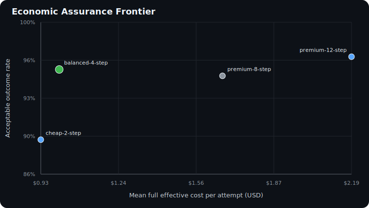

# Agent Economics Lab

**Find the lowest-cost tested agent configuration that stays within a
confidence-bounded regression policy.**

[](https://github.com/Vyoma/agent-economics-lab/actions/workflows/test.yml)

> **Status: v0.2 alpha.** The paired frontier is implemented and reproducible. Its
> checked-in study is synthetic, so it validates the method and software, not
> production impact.



## Run the 60-second experiment

Requires Python 3.10+ and no third-party runtime packages.

```bash
make frontier
```

Four configurations are compared on the same 180 synthetic input fingerprints and
rubric version. The frozen
plan requires at least 25% full-cost reduction and an adjusted one-sided upper bound
of no more than 5% on tasks broken versus the reference.

```text
Decision                         ADOPT balanced-4-step

Candidate            Breakage UCB   Cost reduction LCB   Result
balanced-4-step             3.7%                32.0%   eligible
cheap-2-step               12.5%                29.9%   quality fails
premium-12-step             2.6%               -38.9%   cost fails
```

The cheaper arm is not automatically selected. `cheap-2-step` saves more at the
point estimate, but its exact harmful-regression bound fails. `premium-12-step`
improves point quality, but its paired cost interval fails. The selected arm is the
lowest-cost **tested** candidate that clears every predeclared rule.

Inspect the portable artifacts:

- [decision report](research/results/frontier/frontier.md);
- [machine-readable result](research/results/frontier/frontier.json);
- [cost-quality plot](research/results/frontier/frontier.svg);
- [frozen protocol](research/FRONTIER_PROTOCOL.md);
- [fixture data card](research/FRONTIER_DATA_CARD.md); and
- [transparent generator](examples/compute-frontier/generate.py).

## What is substantively different

Experiment platforms already compare scores, latency, and token spend. This project
adds a narrow decision layer for deployment experiments:

```text
same task input digests and rubric across a frozen configuration family
                         |
          full downstream cost per task
   model + tool + labor + remediation + incident
                         |
     exact harmful-regression upper confidence bound
       + paired cost-reduction lower confidence bound
                         |
            INCOMPLETE / HOLD / ADOPT arm
```

- **Paired, not aggregate:** task IDs, input digests, and rubric versions cannot
  change between arms.
- **Fail closed:** missing arms, tasks, full-cost fields, or assurance coverage return
  `INCOMPLETE`; failed runs are not silently dropped.
- **Uncertainty-aware:** zero observed regressions in a small sample never means zero
  risk. Quality uses an exact one-sided Clopper-Pearson upper bound.
- **Multiplicity-aware:** a Bonferroni-adjusted nominal alpha target covers every
  planned candidate's quality and approximate bootstrap cost test. The plan must
  include enough resamples to resolve the adjusted tail.
- **Economically complete:** selection includes model, tool, human, remediation, and
  incident cost, not token price alone.
- **Portable:** Markdown, JSON, SVG, plan digest, and evidence digests are generated
  offline without a vendor runtime.

Read the [frontier method and data contract](docs/frontier.md).

## Issue a single-arm assurance case

The frontier is built on a composable single-arm engine. It joins call-level traces
to outcome labels, human work, remediation, incident loss, and a named baseline,
then returns `INCOMPLETE`, `SCALE`, `ASSIST`, or `STOP`.

```bash
make demo
```

Generate a portable report from your normalized offline exports:

```bash
python3 -m agent_economics evaluate \
  --traces examples/support_trace.csv \
  --outcomes examples/outcomes.csv \
  --rates examples/rates.json \
  --baseline examples/baseline.json \
  --policy examples/policy.json \
  --output assurance-case.md
```

## Engine conformance invariant

The earlier false-green benchmark remains as a secondary property test. Across 98
constructed scenarios and 588 single-check ablations, silently ignoring missing
coverage creates 23 false `SCALE` decisions; the fail-safe engine returns
`INCOMPLETE` instead. This validates routing semantics by construction, not the
prevalence of enterprise failures.

```bash
make benchmark
make reproduce
```

See the [conformance protocol](research/PROTOCOL.md),
[generated rows](research/results/false_green_results.csv), and
[limitations](docs/limitations.md).

## Build it from first principles

The five lessons expose the complete calculation in a sequence small enough to
audit in one sitting:

```bash
make lessons
```

| Lesson | Question answered |
|---|---|
| [`00_reconstruct_task_cost.py`](lessons/00_reconstruct_task_cost.py) | What did the whole multi-call task cost? |
| [`01_gate_on_outcomes.py`](lessons/01_gate_on_outcomes.py) | What did one acceptable outcome cost? |
| [`02_compare_counterfactual.py`](lessons/02_compare_counterfactual.py) | Did the agent beat the real alternative? |
| [`03_bound_runaway_tasks.py`](lessons/03_bound_runaway_tasks.py) | Which warnings and hard caps should fire? |
| [`04_issue_assurance_case.py`](lessons/04_issue_assurance_case.py) | Should this workload scale, assist, or stop? |

Read [`docs/methodology.md`](docs/methodology.md) for the formulas and data contract.

## Modular where it should be

Agent Economics Lab does not replace an observability, eval, or runtime-control
platform. Those systems supply evidence or enforce the resulting decision.

```text
observability/eval exports · CSV · normalized JSON · internal ledger
                            |
                    plain source adapter
                            |
              canonical evidence bundle + digest
                            |
               explicit ordered assurance checks
                            |
       Markdown / JSON + INCOMPLETE / SCALE / ASSIST / STOP
```

See exactly what is installed:

```bash
python3 -m agent_economics capabilities
```

Checks are frozen, typed specifications around ordinary Python functions. There is
no plugin manager, package discovery, or arbitrary code loading. Add or remove a
check by changing one tuple:

```python
checks = tuple(
    check
    for check in default_checks()
    if check.id != "diagnostic.repeated-tool-shape"
) + (my_domain_gate,)
```

The distinction is fail-safe:

- Delete an optional diagnostic: its finding disappears; the decision is unchanged.
- Delete required coverage: the result becomes `INCOMPLETE`, never a false `SCALE`.
- Add a domain gate: it can preserve or restrict the decision without editing core code.
- Replace CSV with normalized JSON: the same canonical evidence produces the same digest.

Run all four operations in the two-minute proof:

```bash
make modularity
```

Read [`docs/modularity.md`](docs/modularity.md) for the contracts and adapter rules.

## What the kernel owns

Agent traces and model cost fields belong in observability products. Cost caps and
cycle detectors belong in runtime guardrails. This project converts their frozen
exports into independent, inspectable single-arm and paired decision artifacts.

```text
source adapter + traces + outcomes + risk/labor cost + counterfactual + policy
                                  |
                                  v
       versioned checks + assurance and frontier manifests
                                  |
       INCOMPLETE / SCALE / ASSIST / STOP / HOLD / ADOPT
```

The included repetition detector is intentionally called a warning. Three tool
calls with the same name and argument *shape* can be suspicious, but that does not
prove equal intent. A directed dependency cycle can be healthy coordination; it
does not prove deadlock. Definitive enforcement comes from explicit budgets,
timeouts, call caps, authorization, and human escalation.

## Who this is for

| Audience | What they can take from the repo |
|---|---|
| Agent engineers | A paired budget frontier, vendor-neutral evidence schema, and deterministic tests |
| Enterprise architects | A reviewable fail-closed deployment experiment artifact |
| FinOps and finance | Confidence-bounded full-cost reduction, not token price alone |
| Product and risk leaders | Explicit harmful-regression tolerance and complete cost boundary |
| Educators | A reproducible cost-quality experiment without cloud credentials |

## Repository map

```text
agent_economics/   paired frontier, evidence adapters, checks, controls, and renderers
examples/          frozen paired experiment, single-arm evidence, and modularity demo
lessons/           five executable steps
research/          hypothesis, protocol, generator, data card, results, and note
templates/         assurance-case worksheet for an enterprise review
docs/              method, limitations, landscape, and launch copy
tests/             unit tests for the math, controls, and claim boundaries
```

## Four contribution lanes

1. **Source adapters:** map a pinned offline vendor or internal export fixture into
   the canonical bundle without adding a live vendor dependency.
2. **Assurance checks:** add domain policy while declaring its mode, version, and
   coverage. Diagnostics cannot change routing; gates can only preserve or restrict it.
3. **Paired frontier cases:** contribute a frozen matched-task experiment with the
   complete candidate family, rubric, margins, full costs, and sharing permission.
4. **Single-arm evidence cases:** contribute a redacted scenario with:

   - a stable task ID across trace and outcome data;
   - an explicit definition of “acceptable” agreed before analysis;
   - all downstream human, remediation, and incident costs;
   - the named process the agent is being compared against; and
   - the policy that would have existed before seeing the result.

Open a paired frontier issue or use
[`templates/agent-economic-assurance-case.md`](templates/agent-economic-assurance-case.md).
Synthetic and fully anonymized cases are welcome.

## Scope and claim boundary

This is a teaching, conformance, and controlled-research lab, not a production
authorization layer, accounting system, or prevalence study. The paired example has
180 synthetic tasks; the engine invariant has 98 constructed scenarios. Before a
production decision, test representativeness, label agreement, assignment bias,
subgroup regressions, cost attribution, policy ownership, and observation-window
effects. See
[`docs/limitations.md`](docs/limitations.md).

Apache-2.0 licensed. Contributions that make the assurance claim more falsifiable
are especially welcome.
