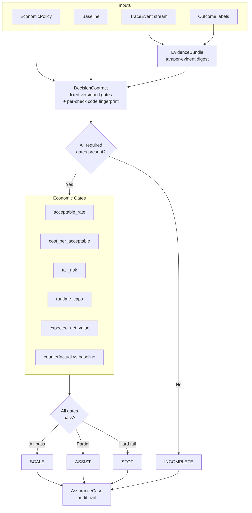

# Agent Economics Lab

**Your agent passed every enabled check. Did every required check run?**

[](https://github.com/Vyoma/agent-economics-lab/actions/workflows/test.yml)

Most teams cannot answer the question finance, product, engineering, and risk all
share: *what did one acceptable outcome actually cost, and what should we do next?*

This repository turns traces, outcomes, downstream cost, and a named alternative
into one bounded decision:

`INCOMPLETE` / `SCALE` / `ASSIST` / `STOP`

## In plain words

You have an AI agent doing real work. You want to know whether to give it more
work, keep a human alongside it, or switch it off.

Counting how often it succeeds is not enough, because a success that took twenty
model calls, ten minutes of someone's cleanup, and one refund is not the same as a
success that took two calls. So this adds up **everything one usable result cost**:
the model spend, the human time afterwards, the fixing, the incidents. Then it
compares that against what you were doing before, and checks the total against
limits you wrote down in advance.

Out comes one word:

| | |
|---|---|
| `SCALE` | worth more work |
| `ASSIST` | keep a human on it |
| `STOP` | costs more than it returns |
| `INCOMPLETE` | **a required check did not run, so there is no answer yet** |

That fourth one is the part most tools get wrong. If a check is switched off, this
refuses to answer instead of quietly answering without it. A green light with a
missing check is not a green light.

The other half of the honesty: it also tells you when its own answer is shaky.
`make sensitivity` shows that 55 of 98 test cases change their verdict if you nudge
the cost assumptions, and `make mutation-score` shows the one attack the design does
*not* stop. Those numbers are in [the honest limits](#the-honest-limits), not buried.

## What makes this different

Every verdict is bound to a fixed, versioned list of required economic
dimensions. Disable a gate and its requirement does not leave with it, so
`INCOMPLETE` becomes the only legal answer. A dynamic engine, one that infers
requirements from whichever gates happen to be enabled, shrinks its own contract
instead and returns `SCALE` on evidence that never cleared the missing gate.

That invariant is not new, and this repository does not claim it. GitHub required
status checks, Kubernetes `failurePolicy: Fail`, in-toto layouts, and DO-178C
safety cases all encode the same rule: a required check that did not run is not a
check that passed. What is less commonly built is applying it to *economic*
dimensions, together with an adjudicated outcome label, full cost including labor
and incident loss, and a named counterfactual.
[Read the prior art and the narrow delta.](docs/landscape.md)

Decisions are therefore framed economically, not by accuracy: `acceptable_rate`,
`cost_per_acceptable_outcome`, `tail_risk`, `runtime_caps`, `expected_net_value`,
and a counterfactual against a named baseline. Every verdict ships with a
tamper-evident `EvidenceBundle` and an `AssuranceCase` audit trail.

A missing gate is not a passing gate. A gate that kept its name and stopped
enforcing is a harder problem, and [the honest limits](#the-honest-limits) below
give the measured numbers for it.

## Architecture


```mermaid
flowchart TD
    subgraph Inputs
        T[TraceEvent stream]
        O[Outcome labels]
        P[EconomicPolicy]
        B[Baseline]
    end

    T & O --> EB["EvidenceBundle\ntamper-evident digest"]
    P & B --> DC
    EB --> DC["DecisionContract\nfixed versioned gates\n+ per-check code fingerprint"]

    DC --> CHECK{"All required\ngates present?"}
    CHECK -->|No| INC["INCOMPLETE"]
    CHECK -->|Yes| G

    subgraph G["Economic Gates"]
        G1[acceptable_rate]
        G2[cost_per_acceptable]
        G3[tail_risk]
        G4[runtime_caps]
        G5[expected_net_value]
        G6[counterfactual vs baseline]
    end

    G --> V{"All gates\npass?"}
    V -->|All pass| S["SCALE"]
    V -->|Partial| A["ASSIST"]
    V -->|Hard fail| ST["STOP"]

    S & A & ST & INC --> AC["AssuranceCase\naudit trail"]
```

The dangerous failure is a contract that changes with the checks that happen to be
enabled. One file reproduces the controlled failure mode:

```bash
python3 false_green.py
```

```text
98 scenarios x 6 required-gate disablements 588 comparisons
dynamic-coverage engine                       23 false SCALE transitions
fixed-contract engine                          0 false SCALE transitions
fixed-contract refusals                  588/588 INCOMPLETE

disabled requirement  false SCALE
outcome_quality      #####                2
unit_economics       ##                   1
tail_risk            #################### 8
business_value       ##                   1
counterfactual       ########             3
runtime_caps         #################### 8
```

> All enabled checks passed is not the same claim as all required checks passed.

The evidence does not change in this experiment. Each intervention disables one
sole-provider gate. A dynamic contract silently shrinks with that gate; the fixed
contract keeps all six requirements and refuses every reduced composition.

Read both numbers precisely. The 23 is a property of a synthetic fixture: it
counts the cases where the disabled gate was the only one failing. The
`588/588` is structural rather than empirical, because the coverage-to-gate map
is one-to-one, so removing any gate necessarily leaves a required dimension
unprovided. Neither number is a production prevalence estimate, and neither is
evidence that the harness is hard to fool. For that, see
[the honest limits](#the-honest-limits).

Read the [protocol](research/FALSE_GREEN_PROTOCOL.md), inspect all
[588 rows](research/results/decision-coverage-drift/results.csv), or copy the
[one-page decision contract](templates/agent-scale-decision-contract.md).

## The honest limits

Two questions decide whether any of the above is worth trusting, and both have
executable answers that are less flattering than the headline.

**Can the harness be fooled?** `make mutation-score` injects 1,176 mutants under
two operators and excludes equivalent mutants from the denominator:

```text
REMOVAL       fixed 510/510 killed (100.0%)   forced by construction, not evidence
              dynamic 487/510 killed (95.5%)

SUBSTITUTION  fixed 487/510 killed (95.5%)
              dynamic 487/510 killed (95.5%)   fixed contract is no better here
              contract digest changed 588/588
```

Removing a gate is caught because required coverage loses its only provider.
Replacing a gate with one that keeps the same ID, version, coverage, and failure
route while enforcing nothing is not caught by coverage at all, and it is the
mutation that actually happens: a threshold loosened during an incident, an
evaluator stubbed out in a migration. Against it the fixed contract scores
exactly what a dynamic one scores. The per-check implementation fingerprint in
the decision-contract digest is the only thing that surfaces it, which is why
every check's source is hashed into the contract.

**Is a verdict stable?** `make sensitivity` sweeps a 48-cell grid of
incident-loss and remediation-cost assumptions per scenario:

```text
ROBUST  (0 flips)        43/98   43.9%
BRITTLE (3+ flips)       55/98   56.1%
Max flips for one scenario                42/48
Counterfactual gate flips at 50% baseline error   25/98  (25.5%)
```

More than half of these synthetic verdicts are artifacts of an economic
assumption rather than stable results, and a 50% error in the baseline flips a
quarter of the counterfactual gates. A baseline is always an estimate. Publish
the fragility index next to the verdict.

## Delete actual evidence

Gate disablement and evidence deletion are different experiments. The second
executable deletes real raw records and fields while keeping checks, coverage, and
the decision-contract digest fixed:

```bash
python3 evidence_ablation.py
```

```text
ablations                  9
operational refusals       4
ASSIST -> SCALE             5
INCOMPLETE case artifacts  0
```

The five transitions expose two concrete source-contract gaps: omitted cost fields
can become zero, and a deleted timed-out event is invisible without an independent
attempt manifest. They are boundary cases, not a failure rate.

[Read the evidence-ablation protocol](research/EVIDENCE_ABLATION_PROTOCOL.md) ·
[Inspect the generated rows](research/results/evidence-ablation/results.csv)

## Run the full decision

Python 3.10+. No cloud account. No third-party runtime packages.

```bash
make demo
```

The included support workload creates positive value versus its human-only
alternative, but the result is still `ASSIST`: outcome quality, unit cost, tail cost,
and runtime caps fail policy. A profitable agent is not automatically a scalable
agent.

This is the literal output, not a summary of it. A test asserts these lines appear
verbatim in what `make demo` prints, so this block cannot drift from the code:

```text
**Decision: ASSIST**

| Measure | Result |
|---|---:|
| Attempts | 8 |
| Acceptable outcomes | 6 (75.0%) |
| Total effective cost | $21.02 |
| Cost per acceptable outcome | $3.50 |
| p95 effective task cost | $14.25 |
| Maximum effective task cost | $14.25 |
| Expected net value per attempt | $3.37 |

- **FAIL · gate.acceptable-rate:** acceptable_rate 75.0% < 80.0%
- **FAIL · gate.unit-economics:** cost_per_acceptable_outcome $3.50 > $2.00
- **FAIL · gate.tail-cost:** p95_task_cost $14.25 > $8.00
- **PASS · gate.net-value:** expected_net_value_per_attempt $3.37 >= $0.00
- **PASS · gate.counterfactual:** incremental_net_value_vs_baseline $2.77 >= $0.00
- **FAIL · gate.runtime-caps:** t-005: 12 calls > cap of 8
- **FAIL · gate.runtime-caps:** t-005: $0.2454 trace cost > cap of $0.1500
```

The full report also prints the assurance manifest, the counterfactual table, the
diagnostic findings, and a claim boundary.

<details>
<summary>Why the output above is text and not a terminal recording</summary>

A recording cannot be re-verified when the code changes. Every other number in this
README is checked byte-for-byte in CI, so a screencast is the one artifact that could
drift out of date without failing anything. The block above is produced by the same
command and asserted line-by-line by a test.

</details>

That is the assurance case: evidence, the fixed decision contract, and routing
semantics remain inspectable.

## Find the cheapest tested configuration that still clears policy

```bash
make frontier
```

The paired frontier runs four configurations on the same 180 synthetic task input
digests and frozen rubric:

```text
Decision                         ADOPT balanced-4-step

Candidate            Absolute UCB   Conditional H/R+   Cost LCB   Result
balanced-4-step             3.7%             1/171       32.0%   eligible
cheap-2-step               12.5%            12/171       29.9%   quality fails
premium-12-step             2.6%             0/171      -38.9%   cost fails
```

The absolute H/N upper bound governs v1 eligibility. The conditional H/R+ rate is
reported because a weak reference can hide breakage in the absolute denominator.
The selected arm's observed cost rank is post-selection exploratory and needs a
held-out or independently replicated confirmation before generalization.

[Read the method](docs/frontier.md) ·
[Inspect the decision](research/results/frontier/frontier.md) ·
[See the protocol](research/FRONTIER_PROTOCOL.md) ·
[Review the data card](research/FRONTIER_DATA_CARD.md)

## The kernel

Keep the observability, evaluation, and runtime-control tools you already use.
Normalize their offline exports, then issue an inspectable decision artifact.

```text
traces + outcomes + labor/risk cost + baseline + policy
                            |
canonical evidence + digest
                            |
     typed checks + fixed required coverage
                            |
       decision-contract digest + bounded decision
```

Delete an optional diagnostic and only its warning disappears. Disable a
sole-provider gate while the contract stays fixed and the decision becomes
`INCOMPLETE`. Add a local gate and it can restrict the result without editing the
core.

```bash
make modularity
```

[Methodology](docs/methodology.md) ·
[Modularity contract](docs/modularity.md) ·
[Architecture](ARCHITECTURE.md) ·
[Limitations](docs/limitations.md)

## Run a non-synthetic public case

Twenty paired SWE-bench Verified tasks compare real mini-SWE-agent trajectories
using Claude Opus 4.6 and Claude Haiku 4.5:

```bash
make public-case
```

Opus resolves `14/20` tasks versus Haiku's `11/20`, while costing 56.9% more
per attempt and 23.3% more per resolved task. The evidence engine returns `STOP`;
the paired uncertainty-aware frontier returns `HOLD`. Prompts, reasoning, patches,
and tool output are excluded, while each complete public trajectory remains
verifiable by its upstream path and SHA-256 digest.

[Inspect the public case](examples/public-swebench/) ·
[Read the AssuranceCase](examples/public-swebench/assurance-case.md) ·
[Read the paired frontier](examples/public-swebench/frontier/frontier.md)

## Convert a Claude Code session without inventing its economics

Claude Code JSONL contains execution facts, not acceptable-outcome labels, a
counterfactual baseline, or a complete price contract. The converter therefore has
two explicit phases:

```bash
agent-economics convert \
  --from claude-code \
  --in session.jsonl \
  --template conversion-contract.json

# Complete the labels, rate tiers, tool costs, baseline, and policy.

agent-economics convert \
  --from claude-code \
  --in session.jsonl \
  --contract conversion-contract.json \
  --out bundle.json

agent-economics evaluate --bundle bundle.json
```

The adapter deduplicates streamed assistant fragments into model calls, prices
base/cache/server-tool usage from the supplied contract, discards prompt and
response content, preserves only content-free tool-argument type shape, and refuses unresolved
delegation or incomplete tool-call inventories.

[Read the adapter contract](docs/claude-code-adapter.md) ·
[Inspect the complete fixture](examples/claude-code/)

## Include delegated Claude Code subagent spend

The separate `claude-code-tree` adapter expands the parent transcript and every
paired subagent transcript before applying the same conversion contract:

```bash
agent-economics convert \
  --from claude-code-tree \
  --in session.jsonl \
  --template conversion-contract.json
```

The adapter discovers `session/subagents/agent-<id>.jsonl` and its matching
metadata files next to `session.jsonl`. Root external prompts remain the economic
tasks. Child model and tool calls inherit the task that spawned them. The source
digest binds the parent, every child transcript, and every metadata file.

Missing pairs, unknown delegation links, duplicate tool identities, inconsistent
spawn depth, and any remaining unexpanded `Agent` or `Task` call return
`INCOMPLETE`. The child bootstrap envelope is verified but not counted twice.

```bash
make claude-code-tree
```

[Read the session-tree contract](docs/claude-code-tree-adapter.md) ·
[Inspect the complete tree fixture](examples/claude-code-tree/)

## Convert OpenTelemetry GenAI exports with one pinned contract

The generic OTLP JSON adapter is tested against content-safe fixtures derived from
Langfuse and Arize OpenInference. It is pinned to OpenTelemetry Semantic
Conventions `1.43.0` and GenAI commit `799e014`.

```bash
agent-economics convert \
  --from otel-genai \
  --in traces.otlp.json \
  --template conversion-contract.json

# Approve trace-to-task mapping. Add labels, prices, baseline, and policy.

agent-economics convert \
  --from otel-genai \
  --in traces.otlp.json \
  --contract conversion-contract.json \
  --out bundle.json
```

The adapter decodes only economic GenAI attributes. It drops prompt, response,
message, tool-definition, argument, and result values. Unknown operations,
unresolved parents, unapproved task mapping, missing usage, and incomplete price
cards return `INCOMPLETE`.

Parent span relationships become typed dependency edges covered by the evidence
digest. The same typed edge field is also populated from Claude Code `parentUuid`
relationships.

[Read the OpenTelemetry contract](docs/otel-genai-adapter.md) ·
[Inspect both fixtures](examples/otel-genai/)

## Label outcomes with Kimi instead of hand-writing them

The one input the engine cannot derive is whether an outcome was acceptable. Two
optional integrations call the [Kimi API](https://platform.kimi.ai/docs/api/chat)
on `kimi-k3`, Moonshot's current flagship, using stdlib `urllib` and no added
dependencies, so that label comes from a frozen rubric rather than from whoever
edited the CSV:

```bash
# Paste your real key. It is "sk-" plus roughly 48 more characters.
export MOONSHOT_API_KEY='sk-REPLACE_THIS_WITH_YOUR_KEY'

agent-economics judge \
  --task-results examples/kimi-judge/task_results.csv \
  --rubric examples/kimi-judge/rubric.json \
  --out outcomes.csv

agent-economics analyse --case report.json
```

`judge` scores every task against weighted rubric criteria, writes a standard
`outcomes.csv`, and writes an audit sidecar recording the model, reasoning depth,
output contract, and every per-criterion score. `analyse` reads an
`evaluate --format json` report and returns recommendations against the same
thresholds.

The request contract is pinned to K3's documented shape: verdicts are forced
through a strict JSON schema derived from the rubric, output length uses
`max_completion_tokens`, sampling parameters are omitted because K3 fixes them
server-side, and the invariant system prompt is sent first so automatic context
caching can reuse it across a batch. Transient `429` and `5xx` responses are
retried with backoff; a `401` fails immediately. That retry policy is load
bearing rather than hygiene: an exhausted call labels the task unacceptable, so a
swallowed rate limit would quietly depress `acceptable_rate` and move every gate
downstream of it.

All inference in the package routes through one client,
`agent_economics.kimi_client`, and a test enforces that: it fails if any module
opens its own connection, declares a second endpoint, or imports another
provider's SDK. The decision kernel is excluded by the same test and performs no
inference at all, because cost reconstruction, gates, and confidence bounds are
arithmetic and their byte-reproducibility is the property this repo exists to
provide. A model belongs where a judgment cannot be computed, and nowhere else.

The label is still a claim owned by the data owner. An LLM judge moves who
authored it, not whether it needs validation: check agreement against human
labels on a sample before trusting the economics built on top.

```bash
make kimi-judge      # live call, requires MOONSHOT_API_KEY
make kimi-eval       # score the judge against 24 labelled cases
make kimi-doctor     # diagnose a 401 without printing the key
make test            # rubric, schema, retry, and fallback conformance, mocked
```

The judge is measured, not just mocked. `make kimi-eval` scores it against 24
constructed cases across seven failure categories and reports a **false-accept
rate**: unacceptable work labelled acceptable inflates `acceptable_rate` and can
turn a `STOP` into a `SCALE`. Expected labels follow from the rubric's own weights,
and a test checks that arithmetic against the rubric file.

Moonshot runs three credential systems whose keys and base URLs are not
interchangeable, so a valid key returns `401` against the wrong one:

| Key from | Base URL |
|---|---|
| platform.kimi.ai | `api.moonshot.ai/v1` (default) |
| platform.moonshot.cn | `api.moonshot.cn/v1` |
| kimi.com/code | `api.kimi.com/coding/v1` |

`export MOONSHOT_BASE_URL=https://<host>` selects one. `make kimi-doctor` probes
all three and reports which accepts your key, without printing it.

The conformance tests mock every API call, so `make reproduce` stays hermetic and
needs no key.

[Read the integration contract](docs/kimi-integration.md) ·
[Inspect the rubric and fixture](examples/kimi-judge/)

## Put the decision contract in a pull request

The composite GitHub Action installs the package, runs the same `evaluate --ci`
path as the CLI, and optionally upserts the Markdown assurance report on the pull
request. Only `SCALE` passes. `INCOMPLETE`, `ASSIST`, and `STOP` fail the check.

```yaml
name: agent-economics

on:
  pull_request:

permissions:
  contents: read
  pull-requests: write

jobs:
  assurance:
    runs-on: ubuntu-latest
    steps:
      - uses: actions/checkout@v6
      - uses: Vyoma/agent-economics-lab@main # Preview only. Pin a commit SHA.
        with:
          bundle: evidence/agent-economics-bundle.json
          github-token: ${{ github.token }}
```

Use exactly one mode:

| Mode | Inputs |
|---|---|
| normalized bundle | `bundle` |
| CSV evidence | `traces`, `outcomes`, `rates`, `baseline`, `policy` |
| offline conversion | `adapter`, `session`, `contract` |

Partial or conflicting modes return `INCOMPLETE`. The action exposes `decision`,
`exit-code`, and `report` outputs. During dogfood, pin an exact commit SHA for any
production use. Stable `v1` tags follow successful dogfood rather than preceding
it.

[Inspect the action contract](action.yml)

## Reproduce everything

```bash
make coverage-drift
make evidence-ablation
make mutation-score
make sensitivity
make completion-vs-verdict
make demo
make frontier
make otel-genai
make reproduce
```

`make reproduce` runs the full test suite, the module-deletion proof, five
executable lessons, both ablation benchmarks, the two-operator mutation score,
the sensitivity sweep, the Claude Code conversion, and byte-for-byte frontier and
both adapter artifact verifications. Every published number in this README is
produced by a target in that list and verified byte-for-byte in CI across Python
3.10 through 3.13.

## Contribute evidence, not integrations on a slide

- Map one pinned offline export into the canonical evidence bundle with a fixture.
- Add one typed gate or diagnostic with explicit failure semantics.
- Contribute one permissioned paired experiment with a frozen task manifest,
  candidate family, rubric, and full-cost boundary.
- Test one real workflow with the
  [blank decision contract](templates/agent-scale-decision-contract.md).
- Submit one counterexample that narrows or falsifies a claim.

Start with [CONTRIBUTING.md](CONTRIBUTING.md) or the issue templates. Do not submit
customer data, secrets, proprietary prompts, or contract pricing.

## Claim boundary

This is a teaching, conformance, and controlled-research lab. It is not a production
authorization layer, accounting system, or prevalence study. The support,
frontier, and Claude Code fixtures are synthetic. The public SWE-bench case uses
observed benchmark trajectories but is not enterprise ROI evidence. Production use
requires representative tasks, label validation, assignment controls, subgroup
analysis, complete cost attribution, policy ownership, and ongoing monitoring.

Apache-2.0 licensed. No third-party runtime dependencies. Derived data,
implemented specifications, and services called at runtime are credited in
[THIRD_PARTY_NOTICES.md](THIRD_PARTY_NOTICES.md). Participation is governed by
the [Code of Conduct](CODE_OF_CONDUCT.md).
