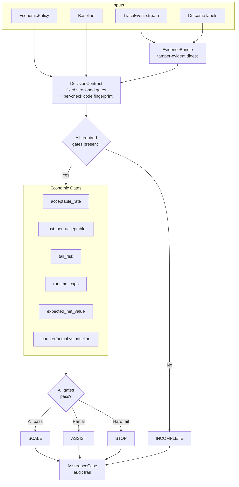

# Agent Economics Lab

**Decide whether an AI agent is worth expanding, worth supervising, or worth
switching off. Backed by what it actually cost, not by how often it looked right.**

[](https://github.com/Vyoma/agent-economics-lab/actions/workflows/test.yml)
[](LICENSE)
[](pyproject.toml)


Every frame of that is generated by `make video` from live decisions, so it cannot
drift from the code. A test fails if it does.

## Start here

```bash
git clone https://github.com/Vyoma/agent-economics-lab && cd agent-economics-lab
make demo
```

No install, no API key, no account. Zero dependencies beyond the Python standard
library. It runs in about a second and prints a real decision on bundled example
data.

| If you want | Go to |
|---|---|
| the shortest real result | [`make label-error`](docs/label-error.md), a judge-accuracy result you can check against your own numbers |
| what this gets wrong | [the honest limits](docs/limitations.md), including four claims of ours that did not survive audit |
| how it works | [architecture](#architecture), then [methodology](docs/methodology.md) |
| whether it is new | [prior art and the narrow delta](docs/landscape.md) |
| to wire it into CI | [`action.yml`](action.yml), it runs as a GitHub Action |

## What this is, in plain words

Skip this section if you work on AI evaluation already.

An **AI agent** is software that uses an AI model to carry out multi-step work on its
own: fixing a bug, resolving a support ticket, processing a claim. Companies are now
deciding how much of that work to hand over. This tool answers that question with
money rather than vibes.

Counting how often the agent succeeds is not enough. A success that took twenty model
calls, ten minutes of somebody's cleanup and one customer refund is not the same as a
success that took two calls. So this adds up **everything one usable result cost**:
the model spend, the human time afterwards, the fixing, the incidents. Then it
compares that against whatever you were doing before, and checks the total against
limits you wrote down in advance.

Out comes one word:

| | |
|---|---|
| `SCALE` | worth giving more work |
| `ASSIST` | keep a person alongside it |
| `STOP` | costs more than it returns |
| `INCOMPLETE` | **a required check did not run, so there is no answer yet** |

### A worked example, with the real numbers

`make demo` runs on bundled data and returns **`ASSIST`**: keep a human involved. Not
because the agent felt unreliable, but because two limits were breached:

| measured | policy limit |
|---|---|
| succeeded 75.0% of the time | needed 80.0% |
| $3.50 per usable result | limit was $2.00 |

The agent works. It is just not yet cheap enough to expand, and the numbers say so
specifically enough to argue with.

### Why the fourth verdict is the point

`INCOMPLETE` is what most tools get wrong. If one of the required checks was switched
off, this **refuses to answer** rather than quietly answering without it. A green
light with a missing check is not a green light.

The other half of that honesty: it reports when its own answer is fragile.
`make sensitivity` shows 55 of 98 test cases flip their verdict if you nudge the cost
assumptions, and `make mutation-score` shows the one attack the design does *not*
stop. Those are in [the honest limits](#the-honest-limits), not buried.

**Your agent passed every enabled check. Did every required check run?**

## Check this repository without trusting it

Everything below is something *this project* checked. A reader who does not run
the code has to take it on faith, which is the posture this package exists to
argue against, applied to itself.

So the claims are portable and you can refute them:

```bash
agent-economics verify --claim research/claims/claude-code.claim.json \
                       --bundle examples/claude-code/bundle.json
```

Exit 0 `SUPPORTED`, 2 `UNVERIFIED`, 4 `REFUTED`. The verifier recomputes the
evidence digest, rebinds every check by identity *and* by the source text that
implemented it, recomputes the decision contract, and re-runs the engine. Hand
it different evidence and it exits 4. Hand it a claim naming a check whose
source differs from yours and it exits 2, because a claim you cannot reproduce
is not a claim you have disproved.

`UNVERIFIED` is the load-bearing verdict. A verifier that cannot separate
"false" from "I could not tell" is the same fail-open catalogued below, moved
one level up, so no failure path returns `SUPPORTED` and none raises.

**Every version of this was forgeable until an adversary was pointed at it.**
Four forgeries, each verifying `SUPPORTED` against evidence that did not
support the claim, and each is now a regression test in `tests/test_claim.py`:

1. **Subsetting the contract.** A claim states its own contract, so the issuer
   chooses it. Dropping the single failing gate and requiring no coverage
   produced "Safe to scale: every gate passes" against evidence whose honest
   verdict was `ASSIST`. `SUPPORTED` now requires every dimension the shipped
   contract requires.
2. **Shipping your own pass marks.** That fix was structural and the numbers
   were still free. Thresholds live in the bundle, so the audited party
   supplies them: identical events, identical labels, honest digest, every
   dimension covered, and setting `min_acceptable_rate` to `0.0` turned
   `ASSIST` into `SCALE`. Worse, the verifier printed "contract is at least as
   strong as the shipped one" while doing it, which was false as printed. A
   threshold no gate could fail against is now detected and named — a gate that
   keeps its name and cannot fail, arriving through the numbers instead of the
   gate list.
3. **A self-attested digest.** `verify` compared `bundle.digest` without
   recomputing it. `digest` is a stored field, so flipping every outcome label
   with `dataclasses.replace` left the published digest intact. It is now
   recomputed from contents.
4. **Prose that reads as endorsed.** `assertion` is free text bound to nothing,
   and the output headlined `# SUPPORTED` directly above it. "Zero breaches,
   safe for unsupervised rollout" verified against an `ASSIST`. The heading now
   names the decision, and the wording is labelled as the issuer's, unverified.

`verify()` was also not total, which its own docstring promised: the handler
catching failures read `claim.assertion` *after* the failure, so passing a
parsed dict — the likeliest caller mistake — raised `AttributeError` from
inside the guard written to prevent it.

What it still does not do: nothing here establishes that the evidence describes
reality. A bundle can be internally perfect and a fabrication. This verifies
the inference, not the world, and says so in its own output.

## The finding: defects that were live while the suite was green

Every bug benchmark I know of hands you a failing test and asks for a fix.
SWE-bench, Defects4J, BugsInPy, QuixBytes: the failing test **is** the task.
Mutation testing swaps the roles, but its mutants are synthetic and the suite
is the thing being scored.

This repository accumulated the other case, and did not go looking for it.
Five defects, catalogued with the commit each was live at, in a package whose
entire purpose is refusing to report numbers it cannot support, written by
someone hunting exactly this class of error:

| defect | commit | tests passing | suite green |
|---|---|---|---|
| the gate paid teams to delete their own honesty field | `4b60e19` | 448 | **yes** |
| a dollar figure computed from costs nothing had priced | `4b60e19` | 448 | **yes** |
| rate-priced subagent spend weighed nothing | `ffb6ca4` | 455 | **yes** |
| the fix for the row above left the gate unable to price anything | `dbc28e8` | 462 | **yes** |
| tool calls asserted free with no rate card to say so | `dbc28e8` | 462 | **yes** |

**5 of 5 were live at a commit where the entire suite passed.** The five sit at
three distinct commits, so the distinct suite total is 1365 tests, not the 2275
an earlier version of this section published by summing the column.

That statistic is weaker than it first looks, and the weakness is fatal to the
strong reading. Every fix commit in this repository adds its regression test in
the same commit. So "the suite was green at the parent of the fix" reduces to
"the regression test did not exist yet", which is true of essentially every bug
fix in every repository. `make green-defects` measures commit hygiene, not a
property of defects, and 5 of 5 is the expected result anywhere.

The asset is not the defect list. It is the **discriminating probe** attached
to each one: the input that makes the wrong number visibly wrong. For the third
row, one run with $100 of declared subagent spend and $18 of undeclared spend:
closure reported 100% and $0.00 unaccounted. That probe is what no test had,
and writing probes is the only technique on the list that ever found anything.

The fourth row is the one to sit with. It was introduced *by the fix for the
third*, in the same file, within the hour, by an agent that had just written
the lesson about that exact class of error. The suite stayed green across it.

Five defects, one repository, one author, one day. That is a case series, not
a rate, and it does not estimate how often this happens anywhere else. What it
establishes is existence and mechanism: a green suite is evidence that
specified behaviour holds, never that the specification produces a number worth
reporting, and every defect above sat inside that gap.
[The full corpus, with each probe.](research/GREEN_DEFECTS.md)

### Then the same method, run forwards

A corpus assembled after the fact cannot report a hit rate, because suspicion
found those five, not a method. So the method was written down and the target
list committed *before* any probe: all five defects share a sharper form than
any single code smell, namely one quantity computed two ways with one way wrong.
Enumerating those divergences gave 18 sites at pre-registration, against 285 for
the naive shapes (the regenerated file now reads 288 as the package grew). `research/PROBE_SITES.md` regenerates from current code, so it
now reads 17 against 285: the fixes removed one. The pre-registered file is the
git blob at `552323b`, not the working copy.

**18 divergences probed, 3 real defects at 3 sites**, or 3/13 counted as
distinct sites.

The count went 3, then 2, then 3, and the movement is worth more than the
number. It was first published as 3 by counting a crash the detector never
pointed at; an adversarial review removed that, correctly. A second review then
found a real fail-open at a site this repository had published as *probed and
correct*: blank token columns in a CSV were priced at $0.00 against the rate
card, and `gate.unit-economics` passed on "$0.00 <= $2.00". The probe had been
run with a bundle whose events carried explicit costs, so it could not observe
the defect it was aimed at, and it reported a miss that looked like diligence.

A wrong probe is worse than no probe. It converts an unexamined site into an
examined one in the record while examining nothing.

The largest defect in this repository came out of it. The CSV evidence path
could not express delegation at all: a trace with two `Agent` calls and $500 of
subagent spend reported zero delegations, 100% closure, and **the gate passed**,
saying "no delegation in this run". The schema had no column for the graph, so
the absence of a record was reported as the absence of the thing.

[The site list](research/PROBE_SITES.md), whose pre-registered version is
`git show 552323b:research/PROBE_SITES.md`, and [what probing it found, misses
included](research/PROBE_RESULTS.md). The detector on [code it did not come
from](research/HELD_OUT.md), where it found nothing.

### What this is not

The technique is old and the repository should have said so from the start.
Publishing it as a new category was the sixth novelty claim made here without
the adversarial prior-art sweep the project's own process demands, and an
adversarial review found the omission immediately.

Deriving an oracle where none exists is **the oracle problem**, surveyed by Barr
et al. (IEEE TSE, 2015). The standard answer is **metamorphic testing** (Chen
et al., 1998), which asserts a relation between two runs rather than a value for
one. D07 is a textbook metamorphic relation, and this repository already ships
three of them in `tests/test_stress_properties.py` — permutation invariance and
two monotonicity relations. The claim in `GREEN_DEFECTS.md` that such a defect
is one "no single-case assertion can express" is refuted by a file in the same
suite. What actually happened is narrower and duller: those relations were
written for the decision kernel and never applied to `audit()`.

Enumerating call sites that disagree about an optional argument, and ranking by
how lopsided the disagreement is, is **Engler et al., "Bugs as Deviant
Behavior" (SOSP 2001)**, which infers beliefs from code and ranks deviations by
exactly that ratio. `inconsistent_callers()` is a re-implementation of a
twenty-five-year-old idea, arrived at independently, which is not the same as
arriving at it first. Related: differential testing (McKeeman, 1998), N-version
programming and its correlated-error problem (Knight and Leveson, 1986).

And the "green while live" statistic is close to a tautology, addressed above.

The honest delta is the target, not the technique: applying deviance inference
and metamorphic relations to an assurance system's own honesty — the gates that
decide whether to trust an AI system — rather than to the system under test.
That is a small delta. It is the one that survives.

## What makes this different

Every verdict is bound to a fixed, versioned list of required economic
dimensions. Disable a gate and its requirement does not leave with it, so
`INCOMPLETE` becomes the only legal answer. A dynamic engine, one that infers
requirements from whichever gates happen to be enabled, shrinks its own contract
instead and returns `SCALE` on evidence that never cleared the missing gate.

That invariant is not new, and this repository does not claim it. GitHub required
status checks, Kubernetes `failurePolicy: Fail`, in-toto layouts, and DO-178C
safety cases all encode the same rule: a required check that did not run is not a
check that passed. What is less commonly built is applying it to *economic*
dimensions, together with an adjudicated outcome label, full cost including labor
and incident loss, and a named counterfactual.
[Read the prior art and the narrow delta.](docs/landscape.md)

Decisions are therefore framed economically, not by accuracy: `acceptable_rate`,
`cost_per_acceptable_outcome`, `tail_risk`, `runtime_caps`, `expected_net_value`,
and a counterfactual against a named baseline. Every verdict ships with a
tamper-evident `EvidenceBundle` and an `AssuranceCase` audit trail.

A missing gate is not a passing gate. A gate that kept its name and stopped
enforcing is a harder problem, and [the honest limits](#the-honest-limits) below
give the measured numbers for it.

## Architecture


```mermaid
flowchart TD
    subgraph Inputs
        T[TraceEvent stream]
        O[Outcome labels]
        P[EconomicPolicy]
        B[Baseline]
    end

    T & O --> EB["EvidenceBundle\ntamper-evident digest"]
    P & B --> DC
    EB --> DC["DecisionContract\nfixed versioned gates\n+ per-check code fingerprint"]

    DC --> CHECK{"All required\ngates present?"}
    CHECK -->|No| INC["INCOMPLETE"]
    CHECK -->|Yes| G

    subgraph G["Economic Gates"]
        G1[acceptable_rate]
        G2[cost_per_acceptable]
        G3[tail_risk]
        G4[runtime_caps]
        G5[expected_net_value]
        G6[counterfactual vs baseline]
    end

    G --> V{"All gates\npass?"}
    V -->|All pass| S["SCALE"]
    V -->|Partial| A["ASSIST"]
    V -->|Hard fail| ST["STOP"]

    S & A & ST & INC --> AC["AssuranceCase\naudit trail"]
```

The dangerous failure is a contract that changes with the checks that happen to be
enabled. One file reproduces the controlled failure mode:

```bash
python3 false_green.py
```

```text
98 scenarios x 6 required-gate disablements 588 comparisons
dynamic-coverage engine                       23 false SCALE transitions
fixed-contract engine                          0 false SCALE transitions
fixed-contract refusals                  588/588 INCOMPLETE

disabled requirement  false SCALE
outcome_quality      #####                2
unit_economics       ##                   1
tail_risk            #################### 8
business_value       ##                   1
counterfactual       ########             3
runtime_caps         #################### 8
```

> All enabled checks passed is not the same claim as all required checks passed.

The evidence does not change in this experiment. Each intervention disables one
sole-provider gate. A dynamic contract silently shrinks with that gate; the fixed
contract keeps all six requirements and refuses every reduced composition.

Read both numbers precisely. The 23 is a property of a synthetic fixture: it
counts the cases where the disabled gate was the only one failing. The
`588/588` is structural rather than empirical, because the coverage-to-gate map
is one-to-one, so removing any gate necessarily leaves a required dimension
unprovided. Neither number is a production prevalence estimate, and neither is
evidence that the harness is hard to fool. For that, see
[the honest limits](#the-honest-limits).

Read the [protocol](research/FALSE_GREEN_PROTOCOL.md), inspect all
[588 rows](research/results/decision-coverage-drift/results.csv), or copy the
[one-page decision contract](templates/agent-scale-decision-contract.md).

## The honest limits

Two questions decide whether any of the above is worth trusting, and both have
executable answers that are less flattering than the headline.

**Can the harness be fooled?** `make mutation-score` injects 1,176 mutants under
two operators and excludes equivalent mutants from the denominator:

```text
REMOVAL       fixed 510/510 killed (100.0%)   forced by construction, not evidence
              dynamic 487/510 killed (95.5%)

SUBSTITUTION  fixed 487/510 not SCALE (95.5%)
              dynamic 487/510 not SCALE (95.5%)  fixed contract is no better
              contract digest changed 588/588
```

Read the substitution row carefully: a non-SCALE result there is **not detection**.
It means other gates were failing too and masked the swap. Neither engine's routing
sees a permissive gate at all.

Removing a gate is caught because required coverage loses its only provider.
Replacing a gate with one that keeps the same ID, version, coverage, and failure
route while enforcing nothing is not caught by coverage at all, and it is the
mutation that actually happens: a threshold loosened during an incident, an
evaluator stubbed out in a migration. Against it the fixed contract scores
exactly what a dynamic one scores. The per-check implementation fingerprint in
the decision-contract digest is what surfaces that case.

**Its scope is narrow and worth stating plainly.** The fingerprint hashes each
check's own source, not the helpers a check calls. It is not transitive. Editing a
shared helper that all six gates route through changes the verdict while leaving
the contract digest byte-identical, which we verified rather than assumed. So the
digest records which check functions produced a verdict; it is not an integrity
guarantee for the engine, and a recipient of an `AssuranceCase` from an untrusted
producer should not read it as one.

**Is your judge good enough?** If an LLM judge supplies the acceptable label and
you gate on cost per acceptable outcome, the label sits in a denominator and its
error is amplified by `1 / acceptable_rate`. The largest error a gate can absorb is
`r*s/(1+s)`, so at a 70% acceptable rate with 10% slack you need **93.6% agreement,
not the 85% commonly treated as sufficient**. How often 85% clears that bar depends on the
slack range considered: 1 of 15 cells with slack up to 25%, 8 of 25 up to 100%. And
`e*` bounds net bias, `|false accepts - false rejects|/n`, not disagreement, so a
balanced judge can disagree 30% of the time and move the metric not at all.

```bash
python3 -m agent_economics.label_error
```

There is a cheaper remedy than a better judge: difference-form metrics such as net
value per attempt do not amplify, so the requirement is a property of the metric you
gate on. [Read the derivation](docs/label-error.md).

**Is a verdict stable?** `make sensitivity` sweeps a 48-cell grid of
incident-loss and remediation-cost assumptions per scenario:

```text
ROBUST  (0 flips)        43/98   43.9%
BRITTLE (3+ flips)       55/98   56.1%
Max flips for one scenario                42/48
Counterfactual gate flips at 50% baseline error   25/98  (25.5%)
```

More than half of these synthetic verdicts are artifacts of an economic
assumption rather than stable results, and a 50% error in the baseline flips a
quarter of the counterfactual gates. A baseline is always an estimate. Publish
the fragility index next to the verdict.

## Delete actual evidence

Gate disablement and evidence deletion are different experiments. The second
executable deletes real raw records and fields while keeping checks, coverage, and
the decision-contract digest fixed:

```bash
python3 evidence_ablation.py
```

```text
ablations                  9
operational refusals       4
ASSIST -> SCALE             5
INCOMPLETE case artifacts  0
```

The five transitions expose two concrete source-contract gaps: omitted cost fields
can become zero, and a deleted timed-out event is invisible without an independent
attempt manifest. They are boundary cases, not a failure rate.

[Read the evidence-ablation protocol](research/EVIDENCE_ABLATION_PROTOCOL.md) ·
[Inspect the generated rows](research/results/evidence-ablation/results.csv)

## Run the full decision

Python 3.10+. No cloud account. No third-party runtime packages.

```bash
make demo
```

The included support workload creates positive value versus its human-only
alternative, but the result is still `ASSIST`: outcome quality, unit cost, tail cost,
and runtime caps fail policy. A profitable agent is not automatically a scalable
agent.

This is the literal output, not a summary of it. A test asserts these lines appear
verbatim in what `make demo` prints, so this block cannot drift from the code:

```text
**Decision: ASSIST**

| Measure | Result |
|---|---:|
| Attempts | 8 |
| Acceptable outcomes | 6 (75.0%) |
| Total effective cost | $21.02 |
| Cost per acceptable outcome | $3.50 |
| p95 effective task cost | $14.25 |
| Maximum effective task cost | $14.25 |
| Expected net value per attempt | $3.37 |

- **FAIL · gate.acceptable-rate:** acceptable_rate 75.0% < 80.0%
- **FAIL · gate.unit-economics:** cost_per_acceptable_outcome $3.50 > $2.00
- **FAIL · gate.tail-cost:** p95_task_cost $14.25 > $8.00
- **PASS · gate.net-value:** expected_net_value_per_attempt $3.37 >= $0.00
- **PASS · gate.counterfactual:** incremental_net_value_vs_baseline $2.77 >= $0.00
- **FAIL · gate.runtime-caps:** t-005: 12 calls > cap of 8
- **FAIL · gate.runtime-caps:** t-005: $0.2454 trace cost > cap of $0.1500
```

The full report also prints the assurance manifest, the counterfactual table, the
diagnostic findings, and a claim boundary.

<details>
<summary>Why the output above is text and not a terminal recording</summary>

A recording cannot be re-verified when the code changes. Every other number in this
README is checked byte-for-byte in CI, so a screencast is the one artifact that could
drift out of date without failing anything. The block above is produced by the same
command and asserted line-by-line by a test.

</details>

That is the assurance case: evidence, the fixed decision contract, and routing
semantics remain inspectable.

## Find the cheapest tested configuration that still clears policy

```bash
make frontier
```

The paired frontier runs four configurations on the same 180 synthetic task input
digests and frozen rubric:

```text
Decision                         ADOPT balanced-4-step

Candidate            Absolute UCB   Conditional H/R+   Cost LCB   Result
balanced-4-step             3.7%             1/171       32.0%   eligible
cheap-2-step               12.5%            12/171       29.9%   quality fails
premium-12-step             2.6%             0/171      -38.9%   cost fails
```

The absolute H/N upper bound governs v1 eligibility. The conditional H/R+ rate is
reported because a weak reference can hide breakage in the absolute denominator.
The selected arm's observed cost rank is post-selection exploratory and needs a
held-out or independently replicated confirmation before generalization.

[Read the method](docs/frontier.md) ·
[Inspect the decision](research/results/frontier/frontier.md) ·
[See the protocol](research/FRONTIER_PROTOCOL.md) ·
[Review the data card](research/FRONTIER_DATA_CARD.md)

## The kernel

Keep the observability, evaluation, and runtime-control tools you already use.
Normalize their offline exports, then issue an inspectable decision artifact.

```text
traces + outcomes + labor/risk cost + baseline + policy
                            |
canonical evidence + digest
                            |
     typed checks + fixed required coverage
                            |
       decision-contract digest + bounded decision
```

Delete an optional diagnostic and only its warning disappears. Disable a
sole-provider gate while the contract stays fixed and the decision becomes
`INCOMPLETE`. Add a local gate and it can restrict the result without editing the
core.

```bash
make modularity
```

[Methodology](docs/methodology.md) ·
[Modularity contract](docs/modularity.md) ·
[Architecture](ARCHITECTURE.md) ·
[Limitations](docs/limitations.md)

## Run a non-synthetic public case

Twenty paired SWE-bench Verified tasks compare real mini-SWE-agent trajectories
using Claude Opus 4.6 and Claude Haiku 4.5:

```bash
make public-case
```

Opus resolves `14/20` tasks versus Haiku's `11/20`, while costing 56.9% more
per attempt and 23.3% more per resolved task.

**The useful result is the frontier's `HOLD`, not the engine's `STOP`.** One
harmful transition in 20 pairs gives an exact one-sided upper bound of 24.9% on
the harmful-regression rate, against a predeclared 5% limit. Twenty paired tasks
cannot detect the regression rate the decision depends on, so the honest answer is
that the comparison is undecided. Teams approve model downgrades on evaluations
this size routinely.

**Read the `STOP` with care: it is forced, not earned.** A benchmark resolution is
credited $0 of business value, because the public source publishes no defensible
value for one, and the net-value gate requires a non-negative result. Total cost is
positive, so `expected_net_value` is negative for *any* set of outcome labels and
the routing cannot be anything but `STOP`. That is arithmetic, not a finding about
either model. It demonstrates the refusal path and the audit trail; it says nothing
about whether Opus is worth its price.

Prompts, reasoning, patches, and tool output are excluded, while each complete
public trajectory remains verifiable by its upstream path and SHA-256 digest.

[Inspect the public case](examples/public-swebench/) ·
[Read the AssuranceCase](examples/public-swebench/assurance-case.md) ·
[Read the paired frontier](examples/public-swebench/frontier/frontier.md)

## Convert a Claude Code session without inventing its economics

Claude Code JSONL contains execution facts, not acceptable-outcome labels, a
counterfactual baseline, or a complete price contract. The converter therefore has
two explicit phases:

```bash
agent-economics convert \
  --from claude-code \
  --in session.jsonl \
  --template conversion-contract.json

# Complete the labels, rate tiers, tool costs, baseline, and policy.

agent-economics convert \
  --from claude-code \
  --in session.jsonl \
  --contract conversion-contract.json \
  --out bundle.json

agent-economics evaluate --bundle bundle.json
```

The adapter deduplicates streamed assistant fragments into model calls, prices
base/cache/server-tool usage from the supplied contract, discards prompt and
response content, preserves only content-free tool-argument type shape, and refuses unresolved
delegation or incomplete tool-call inventories.

[Read the adapter contract](docs/claude-code-adapter.md) ·
[Inspect the complete fixture](examples/claude-code/)

## Include delegated Claude Code subagent spend

The separate `claude-code-tree` adapter expands the parent transcript and every
paired subagent transcript before applying the same conversion contract:

```bash
agent-economics convert \
  --from claude-code-tree \
  --in session.jsonl \
  --template conversion-contract.json
```

The adapter discovers `session/subagents/agent-<id>.jsonl` and its matching
metadata files next to `session.jsonl`. Root external prompts remain the economic
tasks. Child model and tool calls inherit the task that spawned them. The source
digest binds the parent, every child transcript, and every metadata file.

Missing pairs, unknown delegation links, duplicate tool identities, inconsistent
spawn depth, and any remaining unexpanded `Agent` or `Task` call return
`INCOMPLETE`. The child bootstrap envelope is verified but not counted twice.

```bash
make claude-code-tree
```

[Read the session-tree contract](docs/claude-code-tree-adapter.md) ·
[Inspect the complete tree fixture](examples/claude-code-tree/)

## Convert OpenTelemetry GenAI exports with one pinned contract

The generic OTLP JSON adapter is tested against content-safe fixtures derived from
Langfuse and Arize OpenInference. It is pinned to OpenTelemetry Semantic
Conventions `1.43.0` and GenAI commit `799e014`.

```bash
agent-economics convert \
  --from otel-genai \
  --in traces.otlp.json \
  --template conversion-contract.json

# Approve trace-to-task mapping. Add labels, prices, baseline, and policy.

agent-economics convert \
  --from otel-genai \
  --in traces.otlp.json \
  --contract conversion-contract.json \
  --out bundle.json
```

The adapter decodes only economic GenAI attributes. It drops prompt, response,
message, tool-definition, argument, and result values. Unknown operations,
unresolved parents, unapproved task mapping, missing usage, and incomplete price
cards return `INCOMPLETE`.

Parent span relationships become typed dependency edges covered by the evidence
digest. The same typed edge field is also populated from Claude Code `parentUuid`
relationships.

[Read the OpenTelemetry contract](docs/otel-genai-adapter.md) ·
[Inspect both fixtures](examples/otel-genai/)

## Label outcomes with Kimi instead of hand-writing them

The one input the engine cannot derive is whether an outcome was acceptable. Two
optional integrations call the [Kimi API](https://platform.kimi.ai/docs/api/chat)
on `kimi-k3`, Moonshot's current flagship, using stdlib `urllib` and no added
dependencies, so that label comes from a frozen rubric rather than from whoever
edited the CSV:

```bash
# Paste your real key. It is "sk-" plus roughly 48 more characters.
export MOONSHOT_API_KEY='sk-REPLACE_THIS_WITH_YOUR_KEY'

agent-economics judge \
  --task-results examples/kimi-judge/task_results.csv \
  --rubric examples/kimi-judge/rubric.json \
  --out outcomes.csv

agent-economics analyse --case report.json
```

`judge` scores every task against weighted rubric criteria, writes a standard
`outcomes.csv`, and writes an audit sidecar recording the model, reasoning depth,
output contract, and every per-criterion score. `analyse` reads an
`evaluate --format json` report and returns recommendations against the same
thresholds.

The request contract is pinned to K3's documented shape: verdicts are forced
through a strict JSON schema derived from the rubric, output length uses
`max_completion_tokens`, sampling parameters are omitted because K3 fixes them
server-side, and the invariant system prompt is sent first so automatic context
caching can reuse it across a batch. Transient `429` and `5xx` responses are
retried with backoff; a `401` fails immediately. That retry policy is load
bearing rather than hygiene: an exhausted call labels the task unacceptable, so a
swallowed rate limit would quietly depress `acceptable_rate` and move every gate
downstream of it.

All inference in the package routes through one client,
`agent_economics.kimi_client`, and a test enforces that: it fails if any module
opens its own connection, declares a second endpoint, or imports another
provider's SDK. The decision kernel is excluded by the same test and performs no
inference at all, because cost reconstruction, gates, and confidence bounds are
arithmetic and their byte-reproducibility is the property this repo exists to
provide. A model belongs where a judgment cannot be computed, and nowhere else.

The label is still a claim owned by the data owner. An LLM judge moves who
authored it, not whether it needs validation: check agreement against human
labels on a sample before trusting the economics built on top.

```bash
make kimi-judge      # live call, requires MOONSHOT_API_KEY
make kimi-eval       # score the judge against 25 labelled cases
make kimi-doctor     # diagnose a 401 without printing the key
make test            # rubric, schema, retry, and fallback conformance, mocked
```

The judge is measured, not just mocked. `make kimi-eval` scores it against 25
constructed cases across eight categories and reports a **false-accept
rate**: unacceptable work labelled acceptable inflates `acceptable_rate` and can
turn a `STOP` into a `SCALE`. Expected labels follow from the rubric's own weights,
and a test checks that arithmetic against the rubric file.

Moonshot runs three credential systems whose keys and base URLs are not
interchangeable, so a valid key returns `401` against the wrong one:

| Key from | Base URL |
|---|---|
| platform.kimi.ai | `api.moonshot.ai/v1` (default) |
| platform.moonshot.cn | `api.moonshot.cn/v1` |
| kimi.com/code | `api.kimi.com/coding/v1` |

`export MOONSHOT_BASE_URL=https://<host>` selects one. `make kimi-doctor` probes
all three and reports which accepts your key, without printing it.

The conformance tests mock every API call, so `make reproduce` stays hermetic and
needs no key.

[Read the integration contract](docs/kimi-integration.md) ·
[Inspect the rubric and fixture](examples/kimi-judge/)

## Put the decision contract in a pull request

The composite GitHub Action installs the package, runs the same `evaluate --ci`
path as the CLI, and optionally upserts the Markdown assurance report on the pull
request. Only `SCALE` passes. `INCOMPLETE`, `ASSIST`, and `STOP` fail the check.

```yaml
name: agent-economics

on:
  pull_request:

permissions:
  contents: read
  pull-requests: write

jobs:
  assurance:
    runs-on: ubuntu-latest
    steps:
      - uses: actions/checkout@v6
      - uses: Vyoma/agent-economics-lab@main # Preview only. Pin a commit SHA.
        with:
          bundle: evidence/agent-economics-bundle.json
          github-token: ${{ github.token }}
```

Use exactly one mode:

| Mode | Inputs |
|---|---|
| normalized bundle | `bundle` |
| CSV evidence | `traces`, `outcomes`, `rates`, `baseline`, `policy` |
| offline conversion | `adapter`, `session`, `contract` |

Partial or conflicting modes return `INCOMPLETE`. The action exposes `decision`,
`exit-code`, and `report` outputs. During dogfood, pin an exact commit SHA for any
production use. Stable `v1` tags follow successful dogfood rather than preceding
it.

[Inspect the action contract](action.yml)

## Ask what your harness cannot tell you

```bash
agent-economics audit --bundle bundle.json --ci
```

One command, four grounds for withholding a verdict: required coverage no check
supplies, which gates actually carry this run, delegated work nobody undertook to
assess, and instruments nobody validated. None of them is a score. Each is a
reason the honest answer is `INCOMPLETE`.

The fourth ground asks what validated your evidence instruments. Answer it by
supplying their calibration records; without one, the audit withholds:

```bash
agent-economics audit --bundle bundle.json \
  --attestations attestations.json --as-of 2026-08-27
```

Each record states a method, an agreement figure, a sample size, what it was
measured against, and when. Agreement is checked against a floor for its own
method, and an unknown method is refused rather than graded on another method's
scale. An instrument whose output is independently checked by something else is
not the sole provider of its evidence and may be exempted with
`--independently-verified`.

A bundle that records no instrument at all is also withheld, and this is
deliberate. While that was merely noted, declaring what produced your labels
made a bundle unassessable until attested and recording nothing made it
assessable, so the tool paid you to delete the field.

It runs on a bundle with no economics at all, so a team with a PII gate and a
jailbreak gate can ask the question without first inventing a rate card. Convert
a real session under a contract that declares no pricing:

```json
{ "pricing": { "unsupplied": "rates" } }
```

Every call keeps its true token counts and states no cost, because nothing
priced it. Where the cost of delegated work cannot be established, closure
counts delegations instead of weighting them by spend and says which it did:
a share of counts and a share of spend are different quantities, so the report
may state the count ratio and the gate refuses to compare it against a
threshold meaning spend. See `examples/checks-only/`, the same session as
`examples/claude-code/` converted without a price card.


```text
- Verdict on the evidence as supplied: **STOP**
- Withheld on: **unprovided coverage**

- `refusal_rate` — no enabled check supplies this
- `jailbreak_safety` is pivotal: removing it flips this run green
```

## What is actually novel here

Less than earlier drafts of this README claimed. Three novelty claims made
here have been refuted by adversarial prior-art sweeps, and the corrections
are recorded alongside the citations that narrowed them:
[what is novel](docs/novelty.md).

## Reproduce everything

```bash
make coverage-drift
make evidence-ablation
make mutation-score
make sensitivity
make completion-vs-verdict
make demo
make frontier
make otel-genai
make reproduce
```

`make reproduce` runs the full test suite, the module-deletion proof, five
executable lessons, both ablation benchmarks, the two-operator mutation score,
the sensitivity sweep, the Claude Code conversion, and byte-for-byte frontier and
both adapter artifact verifications. Every published number in this README is
produced by a target in that list and verified byte-for-byte in CI across Python
3.10 through 3.13.

## Contribute evidence, not integrations on a slide

- Map one pinned offline export into the canonical evidence bundle with a fixture.
- Add one typed gate or diagnostic with explicit failure semantics.
- Contribute one permissioned paired experiment with a frozen task manifest,
  candidate family, rubric, and full-cost boundary.
- Test one real workflow with the
  [blank decision contract](templates/agent-scale-decision-contract.md).
- Submit one counterexample that narrows or falsifies a claim.

Start with [CONTRIBUTING.md](CONTRIBUTING.md) or the issue templates. Do not submit
customer data, secrets, proprietary prompts, or contract pricing.

## Claim boundary

This is a teaching, conformance, and controlled-research lab. It is not a production
authorization layer, accounting system, or prevalence study. The support,
frontier, and Claude Code fixtures are synthetic. The public SWE-bench case uses
observed benchmark trajectories but is not enterprise ROI evidence. Production use
requires representative tasks, label validation, assignment controls, subgroup
analysis, complete cost attribution, policy ownership, and ongoing monitoring.

Apache-2.0 licensed. No third-party runtime dependencies. Derived data,
implemented specifications, and services called at runtime are credited in
[THIRD_PARTY_NOTICES.md](THIRD_PARTY_NOTICES.md). Participation is governed by
the [Code of Conduct](CODE_OF_CONDUCT.md).
