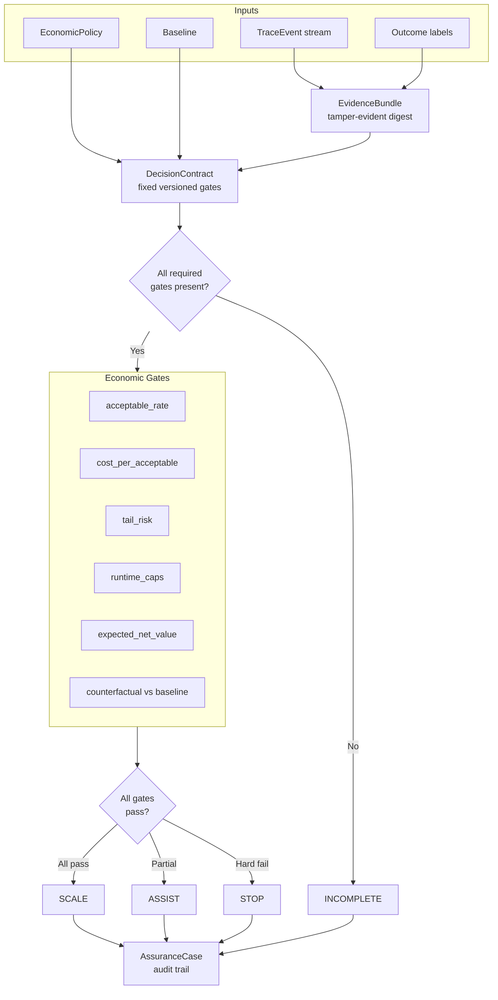

# Agent Economics Lab

**Your agent passed every enabled check. Did every required check run?**

[](https://github.com/Vyoma/agent-economics-lab/actions/workflows/test.yml)

Most teams cannot answer the question finance, product, engineering, and risk all
share: *what did one acceptable outcome actually cost, and what should we do next?*

This repository turns traces, outcomes, downstream cost, and a named alternative
into one bounded decision:

`INCOMPLETE` / `SCALE` / `ASSIST` / `STOP`

## What makes this different

We ran 588 gate-removal mutations against the evaluation harness itself. The fixed-contract engine killed 100% of them. A dynamic engine let 23 survive: 23 false SCALE verdicts on unchanged agents.

The difference is one invariant. A dynamic engine derives its required evidence from whichever gates are currently enabled, so requirements can silently shrink when a gate is disabled during an incident or a config migration. The fixed contract pins a versioned, immutable list: any missing or disabled gate makes INCOMPLETE the only legal answer.

Decisions are framed economically, not by accuracy: `acceptable_rate`, `cost_per_acceptable_outcome`, `tail_risk`, `runtime_caps`, `expected_net_value`, and a counterfactual against a named baseline. Every verdict ships with a tamper-evident `EvidenceBundle` and an `AssuranceCase` audit trail.

A missing gate is not a passing gate.

## Architecture


```mermaid
flowchart TD
    subgraph Inputs
        T[TraceEvent stream]
        O[Outcome labels]
        P[EconomicPolicy]
        B[Baseline]
    end

    T & O --> EB["EvidenceBundle\ntamper-evident digest"]
    P & B --> DC
    EB --> DC["DecisionContract\nfixed versioned gates"]

    DC --> CHECK{"All required\ngates present?"}
    CHECK -->|No| INC["INCOMPLETE"]
    CHECK -->|Yes| G

    subgraph G["Economic Gates"]
        G1[acceptable_rate]
        G2[cost_per_acceptable]
        G3[tail_risk]
        G4[runtime_caps]
        G5[expected_net_value]
        G6[counterfactual vs baseline]
    end

    G --> V{"All gates\npass?"}
    V -->|All pass| S["SCALE"]
    V -->|Partial| A["ASSIST"]
    V -->|Hard fail| ST["STOP"]

    S & A & ST & INC --> AC["AssuranceCase\naudit trail"]
```

The dangerous failure is a contract that changes with the checks that happen to be
enabled. One file reproduces the controlled failure mode:

```bash
python3 false_green.py
```

```text
# Decision-Coverage Drift Conformance Results

- Synthetic scenarios: **98**
- Single required-gate disablements: **588**
- Disablements whose complete result was not SCALE: **510**
- False SCALE transitions under dynamic coverage: **23**
- Dynamic-coverage transition rate among non-SCALE comparisons: **4.5%**
- Dynamic-coverage transition rate across all disablements: **3.9%**
- Fixed-contract decisions returning INCOMPLETE: **588 / 588**
- False SCALE transitions under the fixed contract: **0**

| Disabled gate coverage | Dynamic-coverage false SCALE transitions |
|---|---:|
| `outcome_quality` | 2 |
| `unit_economics` | 1 |
| `tail_risk` | 8 |
| `business_value` | 1 |
| `counterfactual` | 3 |
| `runtime_caps` | 8 |
```

Verbatim, truncated. The full report continues with a per-gate bar chart and the
claim boundary.

> All enabled checks passed is not the same claim as all required checks passed.

We ran that argument against this repository. Three review agents found three CI
checks that were structurally incapable of failing. Two were already on `main`,
one of them since the first commit; the third we introduced ourselves while fixing
this exact class of problem, and caught in pre-merge review:
[the self-audit](research/SELF_AUDIT.md).


The evidence does not change in this experiment. Each intervention disables one
sole-provider gate. A dynamic contract silently shrinks with that gate; the fixed
contract keeps all six requirements and refuses every reduced composition.

The 23 is a property of a synthetic fixture. The zero is an enforced invariant.
Neither is a production prevalence estimate. Read the
[protocol](research/FALSE_GREEN_PROTOCOL.md), inspect all
[588 rows](research/results/decision-coverage-drift/results.csv), or copy the
[one-page decision contract](templates/agent-scale-decision-contract.md).

## Delete actual evidence

Gate disablement and evidence deletion are different experiments. The second
executable deletes real raw records and fields while keeping checks, coverage, and
the decision-contract digest fixed:

```bash
python3 evidence_ablation.py
```

Summary of the run, not verbatim output. `python3 evidence_ablation.py` prints a
full `# Raw Evidence-Ablation Results` report:

```text
ablations                  9
operational refusals       4
ASSIST -> SCALE             5
INCOMPLETE case artifacts  0
```

The five transitions expose two concrete source-contract gaps: omitted cost fields
can become zero, and a deleted timed-out event is invisible without an independent
attempt manifest. They are boundary cases, not a failure rate.

[Read the evidence-ablation protocol](research/EVIDENCE_ABLATION_PROTOCOL.md) ·
[Inspect the generated rows](research/results/evidence-ablation/results.csv)

## Run the full decision

Python 3.10+. No cloud account. No third-party runtime packages.

```bash
make demo
```

The included support workload creates positive value versus its human-only
alternative, but the result is still `ASSIST`: outcome quality, unit cost, tail cost,
and runtime caps fail policy. A profitable agent is not automatically a scalable
agent.

Summary of the run, not verbatim output. `make demo` prints the full Markdown
assurance case:

```text
Decision                         ASSIST
Acceptable outcomes              6 / 8
Cost / acceptable outcome        $3.50
Incremental value / attempt      $2.77
Why not SCALE                    quality, unit cost, tail cost, runtime caps
```

That is the assurance case: evidence, the fixed decision contract, and routing
semantics remain inspectable.

## Find the cheapest tested configuration that still clears policy

```bash
make frontier
```

The paired frontier runs four configurations on the same 180 synthetic task input
digests and frozen rubric:

Summary of the run, not verbatim output. `make frontier` prints the full Markdown
report, including both wide comparison tables:

```text
Decision                         ADOPT balanced-4-step

Candidate            Absolute UCB   Conditional H/R+   Cost LCB   Result
balanced-4-step             3.7%             1/171       32.0%   eligible
cheap-2-step               12.5%            12/171       29.9%   quality fails
premium-12-step             2.6%             0/171      -38.9%   cost fails
```

The absolute H/N upper bound governs v1 eligibility. The conditional H/R+ rate is
reported because a weak reference can hide breakage in the absolute denominator.
The selected arm's observed cost rank is post-selection exploratory and needs a
held-out or independently replicated confirmation before generalization.

[Read the method](docs/frontier.md) ·
[Inspect the decision](research/results/frontier/frontier.md) ·
[See the protocol](research/FRONTIER_PROTOCOL.md) ·
[Review the data card](research/FRONTIER_DATA_CARD.md)

## The kernel

Keep the observability, evaluation, and runtime-control tools you already use.
Normalize their offline exports, then issue an inspectable decision artifact.

```text
traces + outcomes + labor/risk cost + baseline + policy
                            |
canonical evidence + digest
                            |
     typed checks + fixed required coverage
                            |
       decision-contract digest + bounded decision
```

Delete an optional diagnostic and only its warning disappears. Disable a
sole-provider gate while the contract stays fixed and the decision becomes
`INCOMPLETE`. Add a local gate and it can restrict the result without editing the
core.

```bash
make modularity
```

[Methodology](docs/methodology.md) ·
[Modularity contract](docs/modularity.md) ·
[Architecture](ARCHITECTURE.md) ·
[Limitations](docs/limitations.md)

## Run a non-synthetic public case

Twenty paired SWE-bench Verified tasks compare real mini-SWE-agent trajectories
using Claude Opus 4.6 and Claude Haiku 4.5:

```bash
make public-case
```

Opus resolves `14/20` tasks versus Haiku's `11/20`, while costing 56.9% more
per attempt and 23.3% more per resolved task. The evidence engine returns `STOP`;
the paired uncertainty-aware frontier returns `HOLD`. Prompts, reasoning, patches,
and tool output are excluded, while each complete public trajectory remains
verifiable by its upstream path and SHA-256 digest.

[Inspect the public case](examples/public-swebench/) ·
[Read the AssuranceCase](examples/public-swebench/assurance-case.md) ·
[Read the paired frontier](examples/public-swebench/frontier/frontier.md)

## Convert a Claude Code session without inventing its economics

Claude Code JSONL contains execution facts, not acceptable-outcome labels, a
counterfactual baseline, or a complete price contract. The converter therefore has
two explicit phases:

```bash
agent-economics convert \
  --from claude-code \
  --in session.jsonl \
  --template conversion-contract.json

# Complete the labels, rate tiers, tool costs, baseline, and policy.

agent-economics convert \
  --from claude-code \
  --in session.jsonl \
  --contract conversion-contract.json \
  --out bundle.json

agent-economics evaluate --bundle bundle.json
```

The adapter deduplicates streamed assistant fragments into model calls, prices
base/cache/server-tool usage from the supplied contract, discards prompt and
response content, preserves only content-free tool-argument type shape, and refuses unresolved
delegation or incomplete tool-call inventories.

[Read the adapter contract](docs/claude-code-adapter.md) ·
[Inspect the complete fixture](examples/claude-code/)

## Include delegated Claude Code subagent spend

The separate `claude-code-tree` adapter expands the parent transcript and every
paired subagent transcript before applying the same conversion contract:

```bash
agent-economics convert \
  --from claude-code-tree \
  --in session.jsonl \
  --template conversion-contract.json
```

The adapter discovers `session/subagents/agent-<id>.jsonl` and its matching
metadata files next to `session.jsonl`. Root external prompts remain the economic
tasks. Child model and tool calls inherit the task that spawned them. The source
digest binds the parent, every child transcript, and every metadata file.

Missing pairs, unknown delegation links, duplicate tool identities, inconsistent
spawn depth, and any remaining unexpanded `Agent` or `Task` call return
`INCOMPLETE`. The child bootstrap envelope is verified but not counted twice.

```bash
make claude-code-tree
```

[Read the session-tree contract](docs/claude-code-tree-adapter.md) ·
[Inspect the complete tree fixture](examples/claude-code-tree/)

## Convert OpenTelemetry GenAI exports with one pinned contract

The generic OTLP JSON adapter is tested against content-safe fixtures derived from
Langfuse and Arize OpenInference. It is pinned to OpenTelemetry Semantic
Conventions `1.43.0` and GenAI commit `799e014`.

```bash
agent-economics convert \
  --from otel-genai \
  --in traces.otlp.json \
  --template conversion-contract.json

# Approve trace-to-task mapping. Add labels, prices, baseline, and policy.

agent-economics convert \
  --from otel-genai \
  --in traces.otlp.json \
  --contract conversion-contract.json \
  --out bundle.json
```

The adapter decodes only economic GenAI attributes. It drops prompt, response,
message, tool-definition, argument, and result values. Unknown operations,
unresolved parents, unapproved task mapping, missing usage, and incomplete price
cards return `INCOMPLETE`.

Parent span relationships become typed dependency edges covered by the evidence
digest. The same typed edge field is also populated from Claude Code `parentUuid`
relationships.

[Read the OpenTelemetry contract](docs/otel-genai-adapter.md) ·
[Inspect both fixtures](examples/otel-genai/)

## Put the decision contract in a pull request

The composite GitHub Action installs the package, runs the same `evaluate --ci`
path as the CLI, and optionally upserts the Markdown assurance report on the pull
request. Only `SCALE` passes. `INCOMPLETE`, `ASSIST`, and `STOP` fail the check.

```yaml
name: agent-economics

on:
  pull_request:

permissions:
  contents: read
  pull-requests: write

jobs:
  assurance:
    runs-on: ubuntu-latest
    steps:
      - uses: actions/checkout@v6
      - uses: Vyoma/agent-economics-lab@main # Preview only. Pin a commit SHA.
        with:
          bundle: evidence/agent-economics-bundle.json
          github-token: ${{ github.token }}
```

Use exactly one mode:

| Mode | Inputs |
|---|---|
| normalized bundle | `bundle` |
| CSV evidence | `traces`, `outcomes`, `rates`, `baseline`, `policy` |
| offline conversion | `adapter`, `session`, `contract` |

Partial or conflicting modes return `INCOMPLETE`. The action exposes `decision`,
`exit-code`, and `report` outputs. During dogfood, pin an exact commit SHA for any
production use. Stable `v1` tags follow successful dogfood rather than preceding
it.

[Inspect the action contract](action.yml)

## Reproduce everything

```bash
make coverage-drift
make evidence-ablation
make demo
make frontier
make otel-genai
make reproduce
```

`make reproduce` runs the full test suite, the module-deletion proof, five
executable lessons, both ablation benchmarks, the mutation score, the real-trace
verdict, the sensitivity sweep, the Claude Code conversion, the public SWE-bench
case, and byte-for-byte frontier and both adapter artifact verifications.

Every measured result this README publishes is guarded by at least one of two
mechanisms, and some by both: a literal assertion in `tests/`, or a byte-comparison
against a committed artifact, run either from a test or from a `make` target. Both
run in CI. `make coverage` is not part of `make reproduce` and does not run in CI. No test parses this
README, so the link between a sentence here and the assertion that guards it is
convention, not mechanism. The audit that established this, including where it is still weak, is
in [the self-audit](research/SELF_AUDIT.md).

Python 3.10 or newer is required. If your default `python3` is older, pass the
interpreter explicitly:

```bash
make reproduce PYTHON=python3.12
```

### Inspect a single claim

```bash
make mutation      # 588 gate-removal mutations, per-gate kill and survival rates
make real-trace    # naive transcript reading vs the gated verdict, on a real session
make sensitivity   # verdict robustness and the baseline fragility index
make lint          # ruff, matching the CI lint job
make coverage      # reproduces the coverage figures in the changelog
```

## Contribute evidence, not integrations on a slide

- Map one pinned offline export into the canonical evidence bundle with a fixture.
- Add one typed gate or diagnostic with explicit failure semantics.
- Contribute one permissioned paired experiment with a frozen task manifest,
  candidate family, rubric, and full-cost boundary.
- Test one real workflow with the
  [blank decision contract](templates/agent-scale-decision-contract.md).
- Submit one counterexample that narrows or falsifies a claim.

Start with [CONTRIBUTING.md](CONTRIBUTING.md) or the issue templates. Do not submit
customer data, secrets, proprietary prompts, or contract pricing.

## Claim boundary

This is a teaching, conformance, and controlled-research lab. It is not a production
authorization layer, accounting system, or prevalence study. The support,
frontier, and Claude Code fixtures are synthetic. The public SWE-bench case uses
observed benchmark trajectories but is not enterprise ROI evidence. Production use
requires representative tasks, label validation, assignment controls, subgroup
analysis, complete cost attribution, policy ownership, and ongoing monitoring.

Apache-2.0 licensed.
