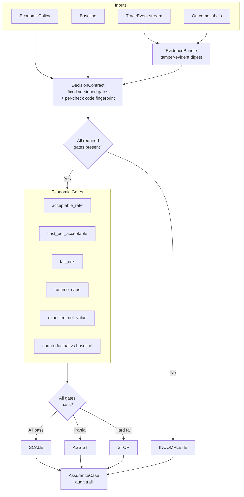

# Agent Economics Lab

**Decide whether an AI agent is worth expanding, worth supervising, or worth
switching off. Backed by what it actually cost, not by how often it looked right.**

[](https://github.com/Vyoma/agent-economics-lab/actions/workflows/test.yml)
[](LICENSE)
[](pyproject.toml)


Every frame of that is generated by `make video` from live decisions, so it cannot
drift from the code. A test fails if it does.

**Pointed at eight public datasets it did not produce, it has filed twelve
results.** The sharpest is about the graders. Across 31,389 runs where an
adjudicated outcome sat beside whether the model's own generated tests passed,
the two agree at Cohen's kappa 0.062: chance. One published model arm reports a
100% resolution rate from a field its own cross-check never confirmed once. Two
arms turn out to be the same 500 runs, and the outcome label disagrees with
itself on 44 of them.

Two of the twelve are clean bills, recorded with the same care as the
defects, and one is a caution against a finding of ours that did not survive
its own stratification. Everything else here is the machinery that made those visible
and the discipline that keeps its own numbers honest.

| | |
|---|---|
| the finding | [Found in the wild](#found-in-the-wild) |
| every finding, citable | [the findings index](research/FINDINGS.md), stable ids and priority dates |
| run it in one second | [Start here](#start-here) |
| check a claim without trusting me | [Check this repository](#check-this-repository-without-trusting-it) |
| what it gets wrong | [the honest limits](docs/limitations.md), four claims of ours that did not survive audit |
| whether it is new | [prior art and the narrow delta](docs/landscape.md) |
| whether it survives a fleet | [the measured envelope](docs/at-scale.md), linear to a million events |
| how good the auditor is | [the instrument's scorecard](research/EVALS.md), every shipped capability measured or named unmeasured |
| the exact contract | [the specification](SPEC.md), conformance-tested clause by clause |

## Found in the wild

Pointed at a public dataset, this produced two things it was built to catch, in
data it did not produce.

All ten model arms of
[swebench-verified-trajectories](https://huggingface.co/datasets/tarsur385/swebench-verified-trajectories),
500 SWE-bench Verified tasks each, 5,000 trajectories. Each carries
`info.resolved`, which reads as the adjudicated outcome, and beside it
`info.scores.resolved`.

It is an independent upload under an individual account, not a release by any of
the vendors whose models the arms are named for. An arm name below identifies a
set of runs in this dataset. It is not a number any vendor published, and nothing
here is a measurement of a model.

| arm | n | naive rate | cross-check unknown | confirmed rate |
|---|---:|---:|---:|---:|
| `claude-4.5-haiku-high` | 500 | 66.6% | 0 | 66.6% |
| `claude-4.5-opus-high` | 500 | 76.8% | 0 | 76.8% |
| `claude-opus-4.6` | 500 | 77.2% | 8 | 76.8% |
| `gemini-3-flash-high` | 500 | 75.8% | 0 | 75.8% |
| `glm-5-high` | 500 | 72.8% | 0 | 72.8% |
| `gpt-5-mini` | 500 | 56.2% | 0 | 56.2% |
| `gpt-5.2-codex` | 500 | 72.8% | 0 | 72.8% |
| `gpt-5.2-high` | 500 | 72.8% | 0 | 72.8% |
| `minimax-m2.5-high` | 500 | 75.8% | 0 | 75.8% |
| `gemini-3-pro` | 500 | 100.0% | 500 | **unestablished** |

**One arm's outcome was never confirmed.** `gemini-3-pro` reads 100% on all 500
tasks from `info.resolved`, at $480.01 of published spend over 25,641 API calls,
while its own cross-check says `"unknown"` for every one.

Harder than any argument about plausible rates: **nine of those 500 runs record
a single API call and no spend, and `info.resolved` is `true` for all nine.**
Whatever those runs were, they did not resolve a SWE-bench issue. What the field
is recording for this arm is not established here; that it is not an adjudicated
outcome, is.

**Two arms are the same runs.** `gpt-5.2-codex` and `gpt-5.2-high` carry
byte-identical transcripts on all 500 tasks — same messages, same cost to
sixteen decimals, same call count — differing only in `model_label` and run id.

That accident is the useful part: it scored the same input twice.
**`info.resolved` disagrees with itself on 44 of those 500, so the label agrees
with itself 91.2% of the time on identical input.** The spread
across the nine scored arms is 20.6 points. The label's own disagreement is 8.8.
Small gaps between models here cannot be distinguished from the instrument
disagreeing with itself.

Neither is a claim that the dataset is wrong: it ships the cross-check that
reveals the first, and the duplication is visible to anyone who hashes the
transcripts. Neither is a claim about any model. What causes the 8.8% is not
established — flaky tests, a non-deterministic environment, and a labelling
pipeline scoring the copies at different times would all look like this.

**The loop closes, and not in this project's favour.** This package has always
demanded to know how good an outcome instrument is. The duplication is a
measurement of one, filed as an attestation against *this dataset's published
labels at this revision* — not against the SWE-bench Verified harness, which is
containerized with pinned tests and did not produce these rows:
`test-retest-agreement`, 0.912, n=500, in
[examples/public-swebench/attestations.json](examples/public-swebench/attestations.json).

Supplying it does **not** make the case assessable. Test-retest measures whether
an instrument repeats itself; an instrument that scores identical inputs
identically every time can be systematically wrong about all of them. The
package now separates the two, records the figure, and still withholds:

```
Withheld on: unattested instruments
  swe-bench-verified.hidden-tests@pinned-upstream:
    test-retest-agreement measures repeatability, not correctness ...
    Supply a validity measurement (agreement-vs-human-adjudication, ...)
```

Measuring repeatability is much easier than measuring correctness, which is
exactly why the easy number must not be allowed to stand in for the hard one.

[The audit, its limits, and the frozen evidence.](research/OUTCOME_AUDIT.md)
Reproducible offline from content-free rows that each carry the SHA-256 of the
upstream trajectory and of its transcript: `make outcome-audit`.

This grew into a registry. [research/CORPUS.md](research/CORPUS.md) audits
public trajectory datasets under one discipline, recording clean bills with
the same care as defects. Eight entries so far, including the official
SWE-bench organisation's own training-trajectory release, where the labels
prove self-consistent everywhere and the `patch` column proves not to be
row-aligned — and one measurement the whole field has a stake in: a dataset
recording adjudicated outcomes beside whether the model's own generated
tests passed, across 31,389 shared runs, puts model-generated tests at
Cohen's kappa 0.062 against adjudication. The cheap oracle everyone wants
agrees with the real one at chance level.

## End to end, on real agent runs

Not a fixture. 40 public [mini-SWE-agent](https://github.com/SWE-agent/mini-swe-agent)
trajectories over 20 paired SWE-bench Verified tasks, from an
[MIT-licensed dataset](https://huggingface.co/datasets/tarsur385/swebench-verified-trajectories)
pinned at a revision. The outcome label is the SWE-bench hidden-test result, so
whether a task was resolved is adjudicated by running the tests, not
self-reported by the agent that attempted it.

```bash
make public-case      # rebuild both arms from the trajectories, byte-compared
make ledger           # verify every published claim, including these
```

What the gates say about real deployments:

| | resolved | spend | per resolved | verdict |
|---|---:|---:|---:|---|
| `claude-opus-4.6` | 14/20 (70%) | $8.44 | $0.60 | **STOP** |
| `claude-4.5-haiku-high` | 11/20 (55%) | $5.37 | $0.49 | **STOP** |

**Read that `STOP` with care: it is forced, not earned.** A benchmark resolution
is credited $0 of business value, because the public source publishes no
defensible value for one, and the net-value gate requires a non-negative result.
Total cost is positive, so `expected_net_value` is negative for *any* set of
outcome labels and the routing cannot be anything but `STOP`. That is arithmetic,
not a finding about either model. The useful result is the frontier's `HOLD`:
one harmful transition in 20 pairs bounds the harmful-regression rate at 24.9%
against a predeclared 5% limit, so the comparison is undecided at this sample
size. Teams approve model downgrades on evaluations this size routinely.

The cheaper model resolves fewer tasks and costs less per resolved task, which
is the trade the gates exist to make explicit rather than to settle.

Three claims about this case are on the record, so the result is refutable by
someone who does not trust the result:

```bash
agent-economics verify \
  --claim research/claims/2026-08-31-swebench-opus-attributed-ae7527bc.claim.json \
  --bundle examples/public-swebench/arms/candidate-opus.json
```

The honest limit: 20 tasks, one harness, one benchmark, and the spend is the
upstream client-side estimate rather than a billing record. This is a worked
case, not a survey. It establishes that the pipeline runs end to end on data
nobody here produced, and what it concludes about those 20 tasks.

## What this is, in plain words

Skip this section if you work on AI evaluation already.

An **AI agent** is software that uses an AI model to carry out multi-step work on its
own: fixing a bug, resolving a support ticket, processing a claim. Companies are now
deciding how much of that work to hand over. This tool answers that question with
money rather than vibes.

Counting how often the agent succeeds is not enough. A success that took twenty model
calls, ten minutes of somebody's cleanup and one customer refund is not the same as a
success that took two calls. So this adds up **everything one usable result cost**:
the model spend, the human time afterwards, the fixing, the incidents. Then it
compares that against whatever you were doing before, and checks the total against
limits you wrote down in advance.

Out comes one word:

| | |
|---|---|
| `SCALE` | worth giving more work |
| `ASSIST` | keep a person alongside it |
| `STOP` | costs more than it returns |
| `INCOMPLETE` | **a required check did not run, so there is no answer yet** |

### A worked example, with the real numbers

`make demo` runs on bundled data and returns **`ASSIST`**: keep a human involved. Not
because the agent felt unreliable, but because measured limits were breached,
five of them across four of the six gates. The two that decide the routing:

| measured | policy limit |
|---|---|
| succeeded 75.0% of the time | needed 80.0% |
| $3.50 per usable result | limit was $2.00 |

The agent works. It is just not yet cheap enough to expand, and the numbers say so
specifically enough to argue with.

### Why the fourth verdict is the point

`INCOMPLETE` is what most tools get wrong. If one of the required checks was switched
off, this **refuses to answer** rather than quietly answering without it. A green
light with a missing check is not a green light.

The other half of that honesty: it reports when its own answer is fragile.
`make sensitivity` shows 55 of 98 test cases flip their verdict if you nudge the cost
assumptions, and `make mutation-score` shows the one attack the design does *not*
stop. Those are in [the honest limits](#the-honest-limits), not buried.

**Your agent passed every enabled check. Did every required check run?**

## Start here

```bash
git clone https://github.com/Vyoma/agent-economics-lab && cd agent-economics-lab
make demo
```

No install, no API key, no account. Zero dependencies beyond the Python standard
library. It runs in about a second and prints a real decision on bundled example
data. Python 3.10 or newer is required; on a machine whose `python3` is older,
every target says so and tells you what to retry with.

The `agent-economics` command used later in this file needs one more step:

```bash
pip install -e .
```

| If you want | Go to |
|---|---|
| the shortest real result | [`make label-error`](docs/label-error.md), a judge-accuracy result you can check against your own numbers |
| what this gets wrong | [the honest limits](docs/limitations.md), including four claims of ours that did not survive audit |
| how it works | [architecture](#architecture), then [methodology](docs/methodology.md) |
| whether it is new | [prior art and the narrow delta](docs/landscape.md) |
| to wire it into CI | [`action.yml`](action.yml), it runs as a GitHub Action |
| to publish a claim of your own | [issue your first claim](#issue-your-first-claim), four commands from a CSV |

## Check this repository without trusting it

Everything below is something *this project* checked. A reader who does not run
the code has to take it on faith, which is the posture this package exists to
argue against, applied to itself.

So the claims are portable and you can refute them:

```bash
agent-economics verify --claim research/claims/2026-08-31-claude-code-4768c6df.claim.json \
                       --bundle examples/claude-code/bundle.json
```

The wild finding is checkable against its source, not just against this
repository's frozen copy of it: `make verify-upstream` fetches a deterministic
sample of rows, plus every row the findings stand on, from the upstream dataset
at its pinned revision, and fails on any hash mismatch. One command, about
twenty fetches, no 740MB download.

**The record carries the invariant, not just verdicts.** Two claims saying "this
fixture does not clear the gates" would be safe and nearly unfalsifiable. Six
more say something a regression would break: *remove this one gate and an
otherwise-passing run yields `INCOMPLETE`, not `SCALE`* — the requirement does
not depart with the gate that served it. Issue your own with
`--omit-check GATE_ID`.

Injecting the dynamic-contract fail-open this project argues against, shrinking
the contract to whatever the enabled checks happen to cover, refutes all six
and fails the build. That is the difference between a record and a
decoration.

The full record is [research/claims/LEDGER.md](research/claims/LEDGER.md).
It is append-only: one file per issuance, named by the date and the revision it
was issued against, never rewritten. `make ledger` regenerates it and **fails
the build on any claim the evidence contradicts**, permanently, until that
claim is retracted rather than quietly regenerated.

Any repository can gate on a claim without cloning this one:

```yaml
- uses: Vyoma/agent-economics-lab@main
  with:
    claim: path/to/some.claim.json
    bundle: path/to/bundle.json
```

Only `SUPPORTED` passes. `REFUTED` and `UNVERIFIED` both fail the job and they
mean different things: the first says the evidence contradicts the claim, the
second says that build cannot reproduce it and names the revision that can.

A claim also pins the commit it was issued against, because it binds each check
by the source text that implemented it. Without the pin, adding a comment
inside a gate body makes every prior claim `UNVERIFIED` — demonstrated, not
assumed — and a record that resets on each refactor is not a record. With it, a
reader can ask two separate questions: is this still true of the code today,
and was it true when it was made.

Exit 0 `SUPPORTED`, 2 `UNVERIFIED`, 4 `REFUTED`. The verifier recomputes the
evidence digest, rebinds every check by identity *and* by the source text that
implemented it, recomputes the decision contract, and re-runs the engine. Hand
it different evidence and it exits 4. Hand it a claim naming a check whose
source differs from yours and it exits 2, because a claim you cannot reproduce
is not a claim you have disproved.

A claim about gates this build does not ship is verifiable too: pass them in.
The claim binds each by source digest, so supplying a permissive substitute is
still `UNVERIFIED`. Before that, a team with a PII gate and a jailbreak gate --
the case this package is built around -- could issue a claim nobody, including
them, could ever check.

`UNVERIFIED` is the load-bearing verdict. A verifier that cannot separate
"false" from "I could not tell" is the same fail-open catalogued below, moved
one level up, so no failure path returns `SUPPORTED` and none raises.

**Every version of this was forgeable until an adversary was pointed at it.**
Four forgeries, each verifying `SUPPORTED` against evidence that did not
support the claim, and each is now a regression test in `tests/test_claim.py`:

1. **Subsetting the contract.** A claim states its own contract, so the issuer
   chooses it. Dropping the single failing gate and requiring no coverage
   produced "Safe to scale: every gate passes" against evidence whose honest
   verdict was `ASSIST`. `SUPPORTED` now requires every dimension the shipped
   contract requires.
2. **Shipping your own pass marks.** That fix was structural and the numbers
   were still free. Thresholds live in the bundle, so the audited party
   supplies them: identical events, identical labels, honest digest, every
   dimension covered, and setting `min_acceptable_rate` to `0.0` turned
   `ASSIST` into `SCALE`. Worse, the verifier printed "contract is at least as
   strong as the shipped one" while doing it, which was false as printed. A
   threshold no gate could fail against is now detected and named — a gate that
   keeps its name and cannot fail, arriving through the numbers instead of the
   gate list.
3. **A self-attested digest.** `verify` compared `bundle.digest` without
   recomputing it. `digest` is a stored field, so flipping every outcome label
   with `dataclasses.replace` left the published digest intact. It is now
   recomputed from contents.
4. **Prose that reads as endorsed.** `assertion` is free text bound to nothing,
   and the output headlined `# SUPPORTED` directly above it. "Zero breaches,
   safe for unsupervised rollout" verified against an `ASSIST`. The heading now
   names the decision, and the wording is labelled as the issuer's, unverified.

`verify()` was also not total, which its own docstring promised: the handler
catching failures read `claim.assertion` *after* the failure, so passing a
parsed dict — the likeliest caller mistake — raised `AttributeError` from
inside the guard written to prevent it.

What it still does not do: nothing here establishes that the evidence describes
reality. A bundle can be internally perfect and a fabrication. This verifies
the inference, not the world, and says so in its own output.

## Issue your first claim

Every command below takes a *bundle*, the normalized evidence format. Until
recently the only way to get one was one of the three adapters, so anyone with
ordinary CSV evidence could evaluate it and never publish a claim about it.
That friction is what keeps a record single-issuer, and it is invisible from
inside the project.

```bash
agent-economics bundle \
  --traces traces.csv --outcomes outcomes.csv \
  --rates rates.json --baseline baseline.json --policy policy.json \
  --label-source "my-team.manual-review@v1" \
  --out bundle.json

agent-economics claim --bundle bundle.json \
  --issuer "my-team" --source-commit "$(git rev-parse HEAD)" \
  --assertion "What you are asserting, in your own words." \
  --output my.claim.json
```

Anyone can then check it without trusting you, and gets `REFUTED` if you hand
them the wrong evidence:

```bash
agent-economics verify --claim my.claim.json --bundle bundle.json
```

`--label-source` is worth filling in. It names what produced your outcome
labels: a rubric version, a judge model, a test suite. Leave it out and the
audit withholds, because nothing then says whether the labels were adjudicated
or defaulted — which is exactly the failure
[found upstream](#found-in-the-wild).

The audit is not a separate opinion you can decline to ask for. An adversarial
review put its finger on the hole: `evaluate --ci` returned exit 0 for a
bundle whose instrument nobody had attested and whose delegation was never
declared, while `audit --ci` withheld on the identical bundle — the auditor
refusing evidence the CI gate passed green, with the reassuring answer as the
default. Every green decision now runs the audit first: a SCALE it refuses is
returned as `INCOMPLETE` with the grounds, on the CLI and in the GitHub
Action alike. Supply calibration with `evaluate --attestations` (the same file
`audit` takes); `ASSIST` and `STOP` pass through, because they are already
refusals to scale. The two commands answering differently for one bundle is
now a class of bug the suite rejects by construction.

## The finding: defects that were live while the suite was green

Every bug benchmark I know of hands you a failing test and asks for a fix.
SWE-bench, Defects4J, BugsInPy, QuixBytes: the failing test **is** the task.
Mutation testing swaps the roles, but its mutants are synthetic and the suite
is the thing being scored.

This repository accumulated the other case, and did not go looking for it.
Five defects, catalogued with the commit each was live at, in a package whose
entire purpose is refusing to report numbers it cannot support, written by
someone hunting exactly this class of error:

| defect | commit | tests passing | suite green |
|---|---|---|---|
| the gate paid teams to delete their own honesty field | `4b60e19` | 448 | **yes** |
| a dollar figure computed from costs nothing had priced | `4b60e19` | 448 | **yes** |
| rate-priced subagent spend weighed nothing | `ffb6ca4` | 455 | **yes** |
| the fix for the row above left the gate unable to price anything | `dbc28e8` | 462 | **yes** |
| tool calls asserted free with no rate card to say so | `dbc28e8` | 462 | **yes** |

**5 of 5 were live at a commit where the entire suite passed.** The five sit at
three distinct commits, so the distinct suite total is 1365 tests, not the 2275
an earlier version of this section published by summing the column.

That statistic is weaker than it first looks, and the weakness is fatal to the
strong reading. Every fix commit in this repository adds its regression test in
the same commit. So "the suite was green at the parent of the fix" reduces to
"the regression test did not exist yet", which is true of essentially every bug
fix in every repository. `make green-defects` measures commit hygiene, not a
property of defects, and 5 of 5 is the expected result anywhere.

The asset is not the defect list. It is the **discriminating probe** attached
to each one: the input that makes the wrong number visibly wrong. For the third
row, one run with $100 of declared subagent spend and $18 of undeclared spend:
closure reported 100% and $0.00 unaccounted. That probe is what no test had,
and writing probes is the only technique on the list that ever found anything.

The fourth row is the one to sit with. It was introduced *by the fix for the
third*, in the same file, within the hour, by an agent that had just written
the lesson about that exact class of error. The suite stayed green across it.

Five defects, one repository, one author, one day. That is a case series, not
a rate, and it does not estimate how often this happens anywhere else. What it
establishes is existence and mechanism: a green suite is evidence that
specified behaviour holds, never that the specification produces a number worth
reporting, and every defect above sat inside that gap.
[The full corpus, with each probe.](research/GREEN_DEFECTS.md)

### Then the same method, run forwards

A corpus assembled after the fact cannot report a hit rate, because suspicion
found those five, not a method. So the method was written down and the target
list committed *before* any probe: all five defects share a sharper form than
any single code smell, namely one quantity computed two ways with one way wrong.
Enumerating those divergences gave 18 sites at pre-registration, against 285 for
the naive shapes. Those are the pre-registered figures, fixed in the git blob
at `552323b`. `research/PROBE_SITES.md` regenerates from current code and moves
as the package grows, so read the current counts there rather than here: an
earlier version of this sentence hand-quoted them and was wrong in both clauses
by the time anyone read it.

**18 divergences probed, 3 real defects at 3 sites**, or 3/12 counted as
distinct sites.

The count went 3, then 2, then 3, and the movement is worth more than the
number. It was first published as 3 by counting a crash the detector never
pointed at; an adversarial review removed that, correctly. A second review then
found a real fail-open at a site this repository had published as *probed and
correct*: blank token columns in a CSV were priced at $0.00 against the rate
card, and `gate.unit-economics` passed on "$0.00 <= $2.00". The probe had been
run with a bundle whose events carried explicit costs, so it could not observe
the defect it was aimed at, and it reported a miss that looked like diligence.

A wrong probe is worse than no probe. It converts an unexamined site into an
examined one in the record while examining nothing.

The largest defect in this repository came out of it. The CSV evidence path
could not express delegation at all: a trace with two `Agent` calls and $500 of
subagent spend reported zero delegations, 100% closure, and **the gate passed**,
saying "no delegation in this run". The schema had no column for the graph, so
the absence of a record was reported as the absence of the thing.

[The site list](research/PROBE_SITES.md), whose pre-registered version is
`git show 552323b:research/PROBE_SITES.md`, and [what probing it found, misses
included](research/PROBE_RESULTS.md). The detector on [code it did not come
from](research/HELD_OUT.md), where it found nothing.

### What this is not

The technique is old and the repository should have said so from the start.
Publishing it as a new category was the sixth novelty claim made here without
the adversarial prior-art sweep the project's own process demands, and an
adversarial review found the omission immediately.

Deriving an oracle where none exists is **the oracle problem**, surveyed by Barr
et al. (IEEE TSE, 2015). The standard answer is **metamorphic testing** (Chen
et al., 1998), which asserts a relation between two runs rather than a value for
one. D07 is a textbook metamorphic relation, and this repository already ships
three of them in `tests/test_stress_properties.py` — permutation invariance and
two monotonicity relations. The claim in `GREEN_DEFECTS.md` that such a defect
is one "no single-case assertion can express" is refuted by a file in the same
suite. What actually happened is narrower and duller: those relations were
written for the decision kernel and never applied to `audit()`.

Enumerating call sites that disagree about an optional argument, and ranking by
how lopsided the disagreement is, is **Engler et al., "Bugs as Deviant
Behavior" (SOSP 2001)**, which infers beliefs from code and ranks deviations by
exactly that ratio. `inconsistent_callers()` is a re-implementation of a
twenty-five-year-old idea, arrived at independently, which is not the same as
arriving at it first. Related: differential testing (McKeeman, 1998), N-version
programming and its correlated-error problem (Knight and Leveson, 1986).

And the "green while live" statistic is close to a tautology, addressed above.

The honest delta is the target, not the technique: applying deviance inference
and metamorphic relations to an assurance system's own honesty — the gates that
decide whether to trust an AI system — rather than to the system under test.
That is a small delta. It is the one that survives.

## What makes this different

Every verdict is bound to a fixed, versioned list of required economic
dimensions. Disable a gate and its requirement does not leave with it, so
`INCOMPLETE` becomes the only legal answer. A dynamic engine, one that infers
requirements from whichever gates happen to be enabled, shrinks its own contract
instead and returns `SCALE` on evidence that never cleared the missing gate.

That invariant is not new, and this repository does not claim it. GitHub required
status checks, Kubernetes `failurePolicy: Fail`, in-toto layouts, and DO-178C
safety cases all encode the same rule: a required check that did not run is not a
check that passed. What is less commonly built is applying it to *economic*
dimensions, together with an adjudicated outcome label, full cost including labor
and incident loss, and a named counterfactual.
[Read the prior art and the narrow delta.](docs/landscape.md)

Decisions are therefore framed economically, not by accuracy: `acceptable_rate`,
`cost_per_acceptable_outcome`, `tail_risk`, `runtime_caps`, `expected_net_value`,
and a counterfactual against a named baseline. Every verdict ships with a
tamper-evident `EvidenceBundle` and an `AssuranceCase` audit trail.

A missing gate is not a passing gate. A gate that kept its name and stopped
enforcing is a harder problem, and [the honest limits](#the-honest-limits) below
give the measured numbers for it.

## Architecture


```mermaid
flowchart TD
    subgraph Inputs
        T[TraceEvent stream]
        O[Outcome labels]
        P[EconomicPolicy]
        B[Baseline]
    end

    T & O --> EB["EvidenceBundle\ntamper-evident digest"]
    P & B --> DC
    EB --> DC["DecisionContract\nfixed versioned gates\n+ per-check code fingerprint"]

    DC --> CHECK{"All required\ngates present?"}
    CHECK -->|No| INC["INCOMPLETE"]
    CHECK -->|Yes| G

    subgraph G["Economic Gates"]
        G1[acceptable_rate]
        G2[cost_per_acceptable]
        G3[tail_risk]
        G4[runtime_caps]
        G5[expected_net_value]
        G6[counterfactual vs baseline]
    end

    G --> V{"All gates\npass?"}
    V -->|All pass| S["SCALE"]
    V -->|Partial| A["ASSIST"]
    V -->|Hard fail| ST["STOP"]

    S & A & ST & INC --> AC["AssuranceCase\naudit trail"]
```

The dangerous failure is a contract that changes with the checks that happen to be
enabled. One file reproduces the controlled failure mode:

```bash
python3 false_green.py
```

```text
98 scenarios x 6 required-gate disablements 588 comparisons
dynamic-coverage engine                       23 false SCALE transitions
fixed-contract engine                          0 false SCALE transitions
fixed-contract refusals                  588/588 INCOMPLETE

disabled requirement  false SCALE
outcome_quality      #####                2
unit_economics       ##                   1
tail_risk            #################### 8
business_value       ##                   1
counterfactual       ########             3
runtime_caps         #################### 8
```

> All enabled checks passed is not the same claim as all required checks passed.

The evidence does not change in this experiment. Each intervention disables one
sole-provider gate. A dynamic contract silently shrinks with that gate; the fixed
contract keeps all six requirements and refuses every reduced composition.

Read both numbers precisely. The 23 is a property of a synthetic fixture: it
counts the cases where the disabled gate was the only one failing. The
`588/588` is structural rather than empirical, because the coverage-to-gate map
is one-to-one, so removing any gate necessarily leaves a required dimension
unprovided. Neither number is a production prevalence estimate, and neither is
evidence that the harness is hard to fool. For that, see
[the honest limits](#the-honest-limits).

Read the [protocol](research/FALSE_GREEN_PROTOCOL.md), inspect all
[588 rows](research/results/decision-coverage-drift/results.csv), or copy the
[one-page decision contract](templates/agent-scale-decision-contract.md).

## The honest limits

Two questions decide whether any of the above is worth trusting, and both have
executable answers that are less flattering than the headline.

**Can the harness be fooled?** `make mutation-score` injects 1,176 mutants under
two operators and excludes equivalent mutants from the denominator:

```text
REMOVAL       fixed 510/510 killed (100.0%)   forced by construction, not evidence
              dynamic 487/510 killed (95.5%)

SUBSTITUTION  fixed 487/510 not SCALE (95.5%)
              dynamic 487/510 not SCALE (95.5%)  fixed contract is no better
              contract digest changed 588/588
```

Read the substitution row carefully: a non-SCALE result there is **not detection**.
It means other gates were failing too and masked the swap. Neither engine's routing
sees a permissive gate at all.

Removing a gate is caught because required coverage loses its only provider.
Replacing a gate with one that keeps the same ID, version, coverage, and failure
route while enforcing nothing is not caught by coverage at all, and it is the
mutation that actually happens: a threshold loosened during an incident, an
evaluator stubbed out in a migration. Against it the fixed contract scores
exactly what a dynamic one scores. The per-check implementation fingerprint in
the decision-contract digest is what surfaces that case.

**Its scope is narrow and worth stating plainly.** The fingerprint hashes each
check's own source, not the helpers a check calls. It is not transitive. Editing a
shared helper that all six gates route through changes the verdict while leaving
the contract digest byte-identical, which we verified rather than assumed. So the
digest records which check functions produced a verdict; it is not an integrity
guarantee for the engine, and a recipient of an `AssuranceCase` from an untrusted
producer should not read it as one.

**Is your judge good enough?** If an LLM judge supplies the acceptable label and
you gate on cost per acceptable outcome, the label sits in a denominator and its
error is amplified by `1 / acceptable_rate`. The largest error a gate can absorb is
`r*s/(1+s)`, so at a 70% acceptable rate with 10% slack you need **93.6% agreement,
not the 85% commonly treated as sufficient**. How often 85% clears that bar depends on the
slack range considered: 1 of 15 cells with slack up to 25%, 8 of 25 up to 100%. And
`e*` bounds net bias, `|false accepts - false rejects|/n`, not disagreement, so a
balanced judge can disagree 30% of the time and move the metric not at all.

```bash
python3 -m agent_economics.label_error
```

There is a cheaper remedy than a better judge: difference-form metrics such as net
value per attempt do not amplify, so the requirement is a property of the metric you
gate on. [Read the derivation](docs/label-error.md).

**Is a verdict stable?** `make sensitivity` sweeps a 48-cell grid of
incident-loss and remediation-cost assumptions per scenario:

```text
ROBUST  (0 flips)        43/98   43.9%
BRITTLE (3+ flips)       55/98   56.1%
Max flips for one scenario                42/48
Counterfactual gate flips at 50% baseline error   25/98  (25.5%)
```

More than half of these synthetic verdicts are artifacts of an economic
assumption rather than stable results, and a 50% error in the baseline flips a
quarter of the counterfactual gates. A baseline is always an estimate. Publish
the fragility index next to the verdict.

## Recipes

Twelve worked examples, each running against data in this repository: converting
a Claude Code session without inventing its economics, including delegated
subagent spend, OpenTelemetry GenAI exports, the public SWE-bench case, judging
outcomes with an external model, composing a contract by name, and putting the
decision contract in a pull request.

They lived here and made this page 1,157 lines, which buried the finding at the
top under instructions for using the tool. [**docs/recipes.md**](docs/recipes.md).

## What is actually novel here

Less than earlier drafts of this README claimed. Three novelty claims made
here have been refuted by adversarial prior-art sweeps, and the corrections
are recorded alongside the citations that narrowed them:
[what is novel](docs/novelty.md).

## Reproduce everything

```bash
make coverage-drift
make evidence-ablation
make mutation-score
make sensitivity
make completion-vs-verdict
make demo
make frontier
make otel-genai
make reproduce
```

`make reproduce` runs the full test suite, the module-deletion proof, five
executable lessons, both ablation benchmarks, the two-operator mutation score,
the sensitivity sweep, the Claude Code conversion, and byte-for-byte frontier and
both adapter artifact verifications. Every published number in this README is
produced by a target in that list and verified byte-for-byte in CI across Python
3.10 through 3.13.

## Contribute evidence, not integrations on a slide

- Map one pinned offline export into the canonical evidence bundle with a fixture.
- Add one typed gate or diagnostic with explicit failure semantics.
- Contribute one permissioned paired experiment with a frozen task manifest,
  candidate family, rubric, and full-cost boundary.
- Test one real workflow with the
  [blank decision contract](templates/agent-scale-decision-contract.md).
- Submit one counterexample that narrows or falsifies a claim.

Start with [CONTRIBUTING.md](CONTRIBUTING.md) or the issue templates. Do not submit
customer data, secrets, proprietary prompts, or contract pricing.

## Claim boundary

This is a teaching, conformance, and controlled-research lab. It is not a production
authorization layer, accounting system, or prevalence study. The support,
frontier, and Claude Code fixtures are synthetic. The public SWE-bench case uses
observed benchmark trajectories but is not enterprise ROI evidence. Production use
requires representative tasks, label validation, assignment controls, subgroup
analysis, complete cost attribution, policy ownership, and ongoing monitoring.

Apache-2.0 licensed. No third-party runtime dependencies. Derived data,
implemented specifications, and services called at runtime are credited in
[THIRD_PARTY_NOTICES.md](THIRD_PARTY_NOTICES.md). Participation is governed by
the [Code of Conduct](CODE_OF_CONDUCT.md).
